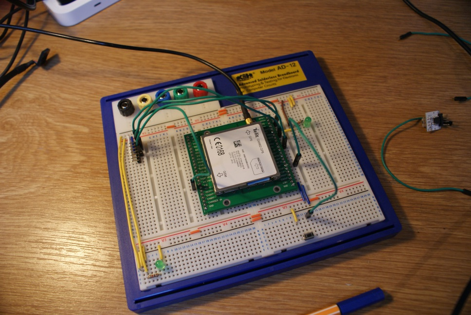
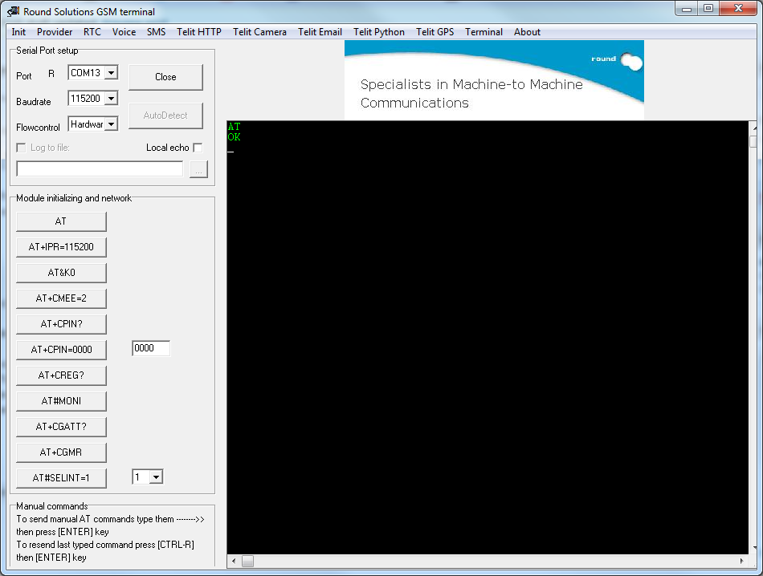
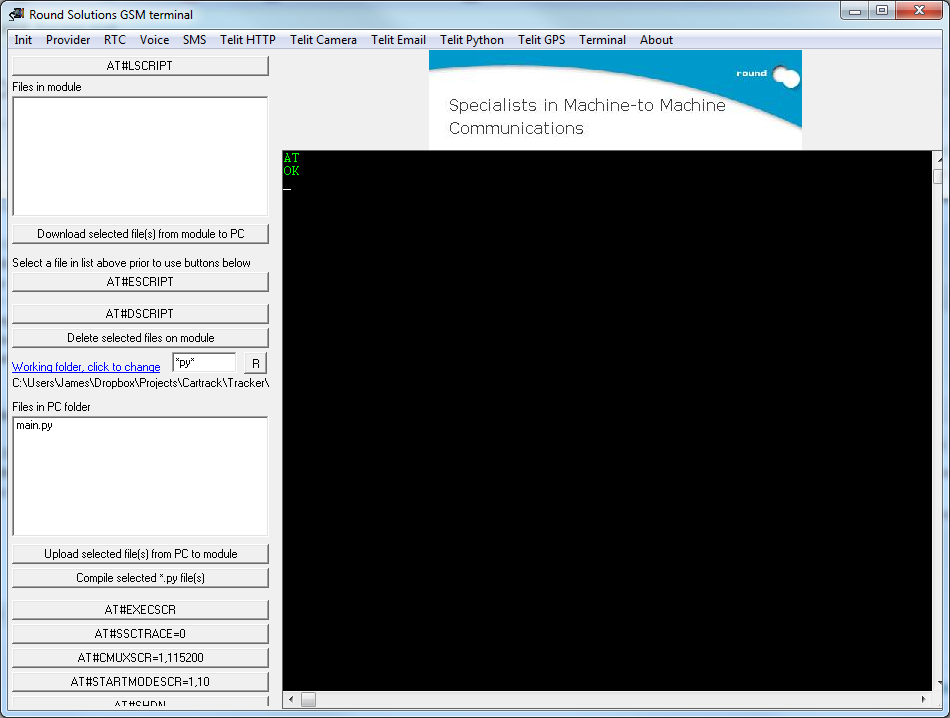
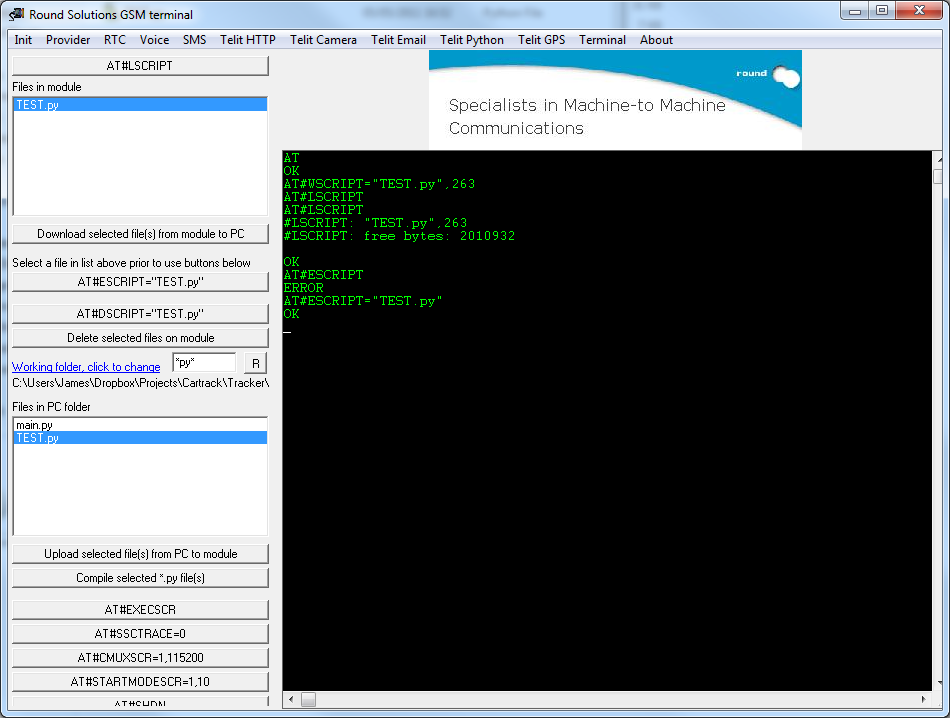
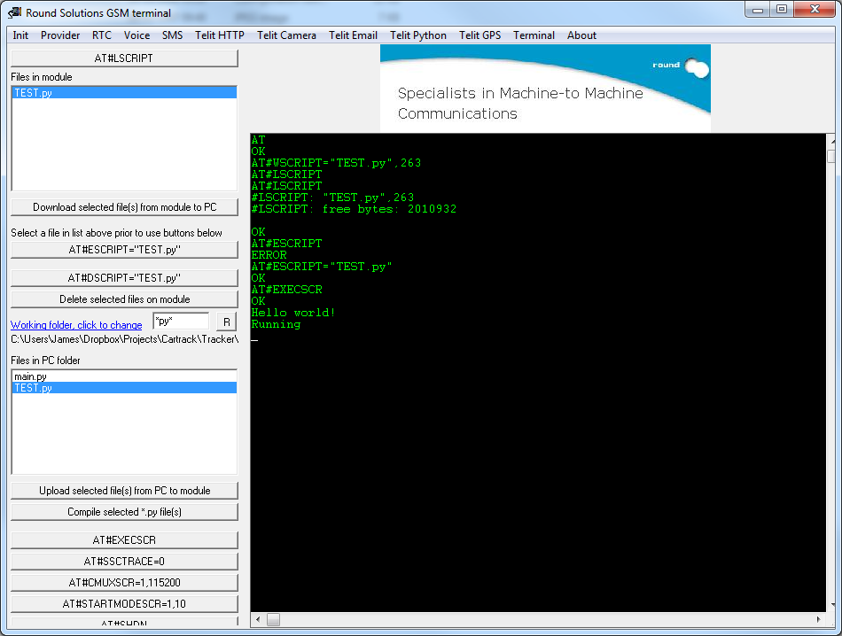

While I have been working on the GPS car tracker project, I encountered a lot of problems with Downloading a script to the device and making it run correctly.

There is a lot of documentation out there, but you have to read a lot just to understand EXACTLY how to do it. So for everyone just getting into trying out these devices, I have written a small tutorial to help you get started =]

### Parts Needed

* Telit GM862-GPS
* Breakout board
* Jumper Leads
* FTDI USB Cable
* Breadboard

### Software Used

* [RSterm - Round Solutions](http://www.roundsolutions.com/techdocs)


### Hello World

Firstly, we need to write a quick script that you can build on for your project. Debugging is very important and is best done by printing text to the Serial port. The following code is a bit complex for a simple ‘Hello World’, But it will make things a lot easier in the long run as it enables you to use the print command freely.
<?prettify?>
```
import MDM
import MOD
import SER
import sys
   
SER.set_speed('115200','8N1')
class SerWriter:
def write(self,s):
SER.send(s+'r')
sys.stdout = sys.stderr = SerWriter()
   
print 'Hello world!'
  
while 1:
    print('Running')
    MOD.sleep(10)
```

Write this in your text editor of choice and save as ‘hello.py’. Thanks to leoperria on the SparkFun forums for this [code](http://forum.sparkfun.com/viewtopic.php?t=6289)!


### Prepare the GM862

I brought the Basic GM862-GPS Kit from Cool Components for £130 which had pretty much everything I needed to do this project, The only other thing I needed was a breadboard which I picked up from Maplin for £9. **Note:** *Cool Components don't seem to sell it any more. But you can probably find it elsewhere online*



The set-up is fairly basic, I’ve added a on button and a status LED in, but they aren’t always needed.
Solder the Header pins onto the breakout board and then fix that to the breadboard, finally snap the GM862 onto the Breakout board, It shouldn’t be too hard to attach so don’t force it!
Now hookup the FTDI cable to the Breadboard like this (colours may differ on your cable):

From the FTDI Cable to the breakout:

* (Black – GND) —–> GND
* (Grey – CTS#) —–> CTS
* (Red – VCC) —–> VCC
* (Orange – TXD) —–> RXD
* (Yellow – RXD) —–> TXT
* (Green – RTS#) —–>RTS

And thats it! We can now start communicating with it and download our first program!

### Setting up RSterm

To communicate with the device, I’m using RSterm which is freely available from the Round Solutions website (link at the top). It has everything you need to work with the device and all of the most useful commands are linked to buttons on different tabs in the window.


Firstly we need to set RSterm to use the Modem and communicate at the same Baudrate and with the right Flow Control.
For transferring the file, RSterm has to use Hardware Flow control and the Baudrate of 115200, We could switch between them if we really wanted, but for now its just easier to use these settings all the time.
Make sure that the FTDI cable is plugged into your USB port and that you have selected the correct com port, you can alternatively use the “AutoDetect” button to search for the modem.
Set the Baudrate and the flow control to the specified settings and click ‘Open’

Now you can test that you are connected by pressing the ‘AT’ button, If all is well you should see ‘OK’ appear in the console window.


If nothing appears, you might either have a loose connection or an issue in RSterm, so step through everything again just to make sure that its set up correctly.

If you do see the ‘OK’ then you will know that your set-up is working!

Click on the ‘Telit Python’ Button on the top bar and the Python tab will show.



Now lets download our script to the device and run it! Firstly, Click on the ‘Working Folder’ link and browse to where you saved the .py file, once selected, click the ‘R’ button to refresh, your script should show up in the box below. Select the file and click the ‘Upload selected file’ button. RSterm will freeze for a second or two, then a message will pop up saying ‘Done’.
The file should now appear in the top list, click on it and then click the ‘AT#ESCRIPT=’ button to enable it. This means that it will be able to run on startup.



Finally, to run it click the ‘AT#EXECSCR’ button, after a few seconds, you should see the output of your script!



Congratulations! You can now build on this script to make your own programs for the GM862!

If you have any questions, feel free to ask them in the comments below!

