<!---->
After spending the last six months working on my Dissertation, it was nice to focus on something a little different that I could use in my day to day life. I decided that I wanted a small mood lamp that I could place on my desk, which would occasionally flash a certain colour when there was an unread email in my inbox or an unseen notification on my Facebook account.

### Outcome

This is what I’ve ended up with so far, the hardware is complete, and I’m just polishing up the python script which is running on my PC. You can see in the video that the cube fades between some random colours, but then flashes red or blue if I have an unread email or Facebook notification.

<iframe width="560" height="315" src="//www.youtube.com/embed/CaFS0iNwX_M" frameborder="0" allowfullscreen></iframe>

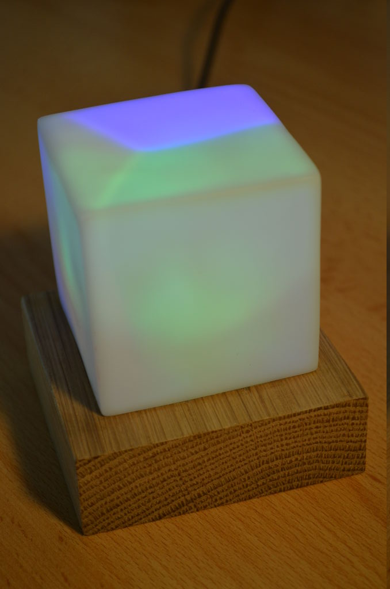

### Design

First stop are the PCB designs, I decided to use a [Teensy++ 2.0](http://www.pjrc.com/teensy/) because I thought that three RGB LEDs would be a nice number, and that the Teensy++ has 9 PWM pins available. I realise that this may have been a bit of overkill and so I might look into shrinking the design down later on.

### Board A

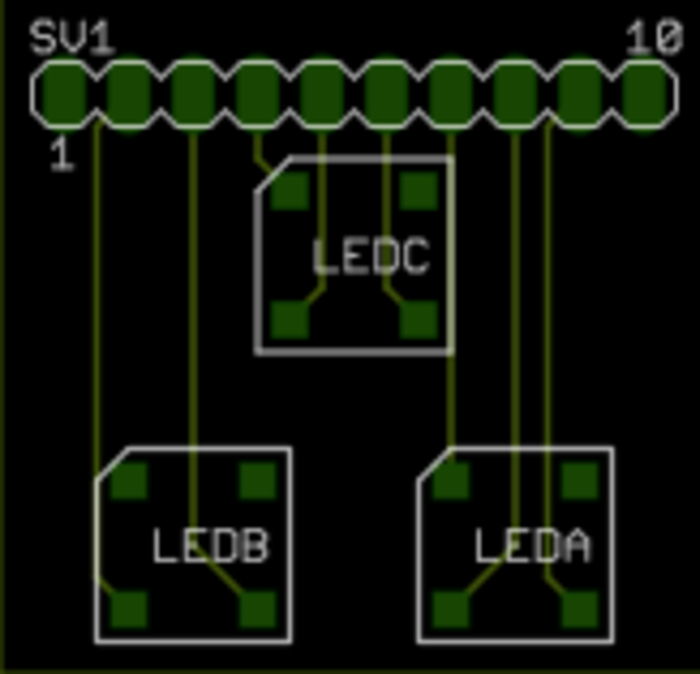

Board A is simply three 8mm square common cathode RGB LEDs connected to a row of header pins. I picked [these](http://www.ebay.co.uk/itm/370262039446?ssPageName=STRK:MEWNX:IT&_trksid=p3984.m1439.l2649) up from ebay which seemed to do just fine!

### Board B

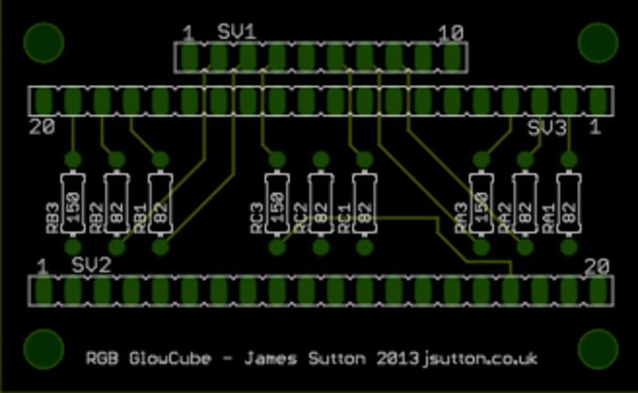

Board B is also pretty simple, Three sets of resistors are used to limit the current between the Teensy++ and the LEDs and there are two headers for the Teensy++ and one for Board A. The Resistors used were 6×82Ω and 3×150Ω at 0.25W and 5%. [Here](http://www.ebay.co.uk/itm/100x-0-25W-5-Carbon-Film-Resistor-0-1k-Ohm-Range-/261029943790?pt=UK_BOI_Electrical_Components_Supplies_ET&var=&hash=item8269f6715f) is where I got mine.

I ordered both PCBs using [BatchPCB](https://www.batchpcb.com/) and received them a few weeks later.

### Build

One other thing that I haven’t mentioned is that the header pins that are used for Board A are extra long so as to rise higher than the Teensy++ when put together. The pins are 19mm long, mine came from [here](http://www.ebay.co.uk/itm/251162897624?ssPageName=STRK:MEWNX:IT&_trksid=p3984.m1439.l2649).

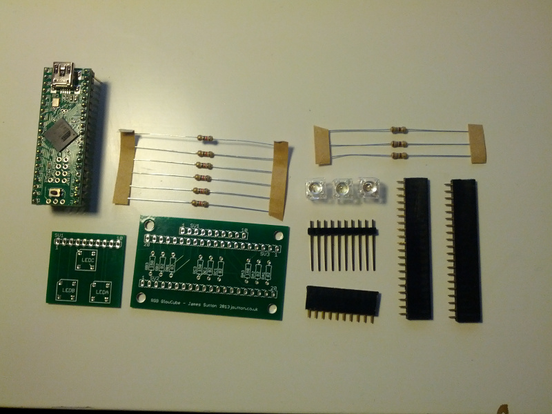

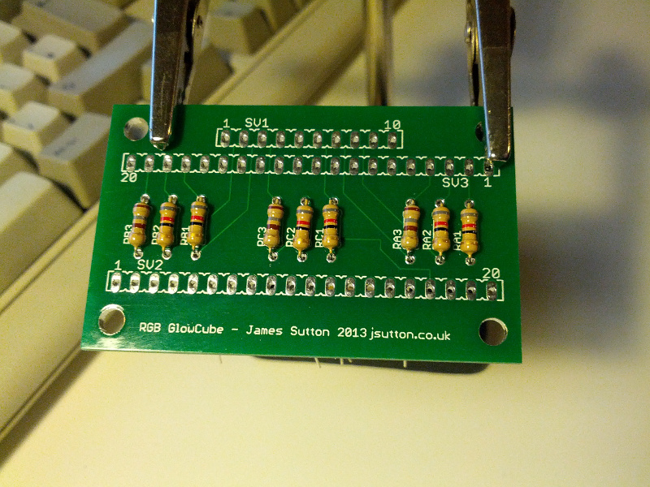

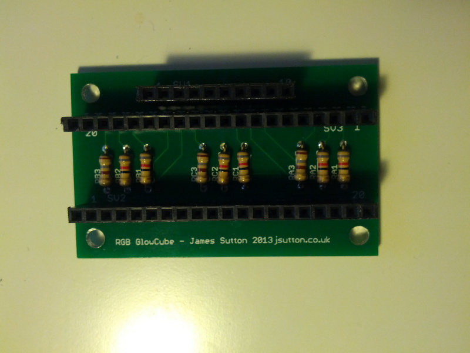

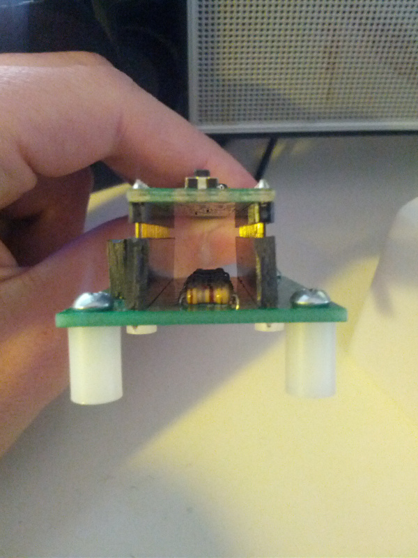

It might not be too easy to see in the image above, but I screwed up the design a little bit and put the header pins too far apart for the Teensy++. Fortunately it was only about 1mm and so I was able to install it at a small angle.

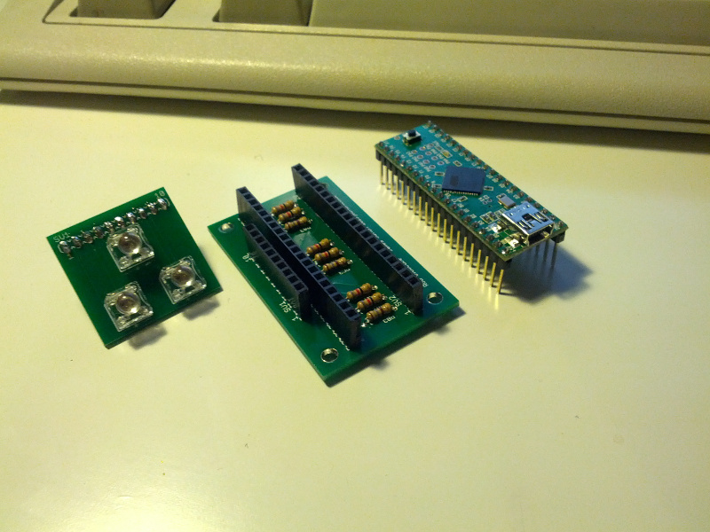

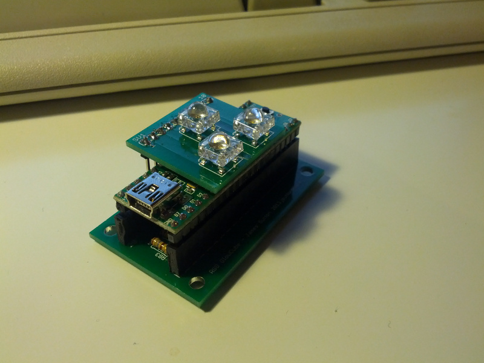

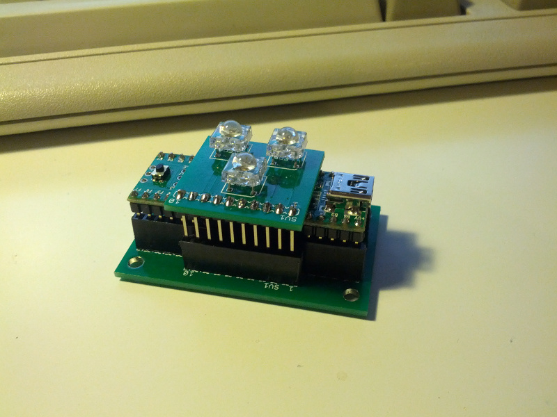

And there we have it, the PCB fully assembled. Next up the enclosure!

Unfortunately I got a bit carried away and built the enclosure (With the help of Dad and his workshop of course) without taking any photos!

As can be seen in the photo above of the finished cube, the oak base (Whatever we could find in the scraps bin!) is about 10mm wider on every edge and is about 25mm deep (80x80x25). The cloudy cube has been glued to the top side with the LEDs going through its base.

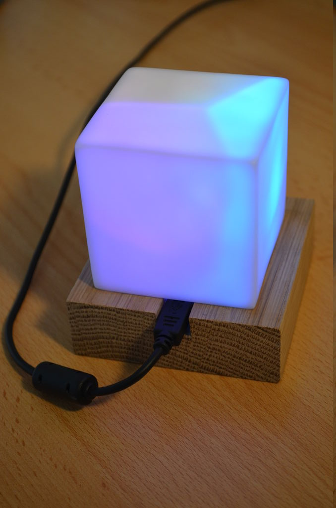

So that the USB cable could be added or removed easily, we cut out a small chunk on of one of the sides that left more than enough room for the connector.

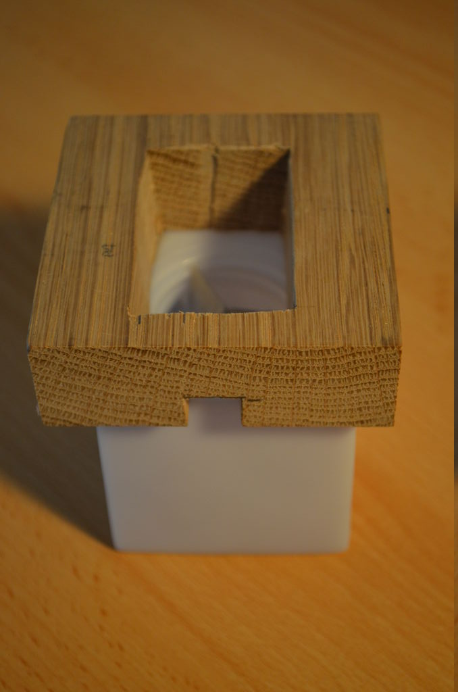

We cut out a hole through the middle which was just big enough to fit the circuit boards using a drill and a jigsaw and glued the cube to the base using some wood glue.

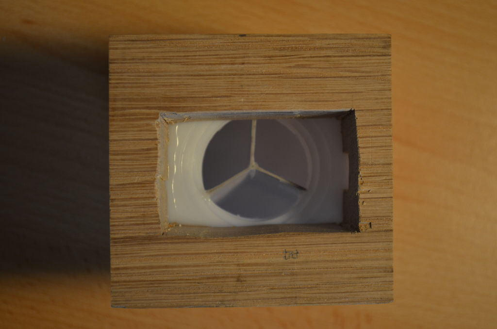

We cut out a hole through the middle which was just big enough to fit the circuit boards using a drill and a jigsaw and glued the cube to the base using some wood glue.

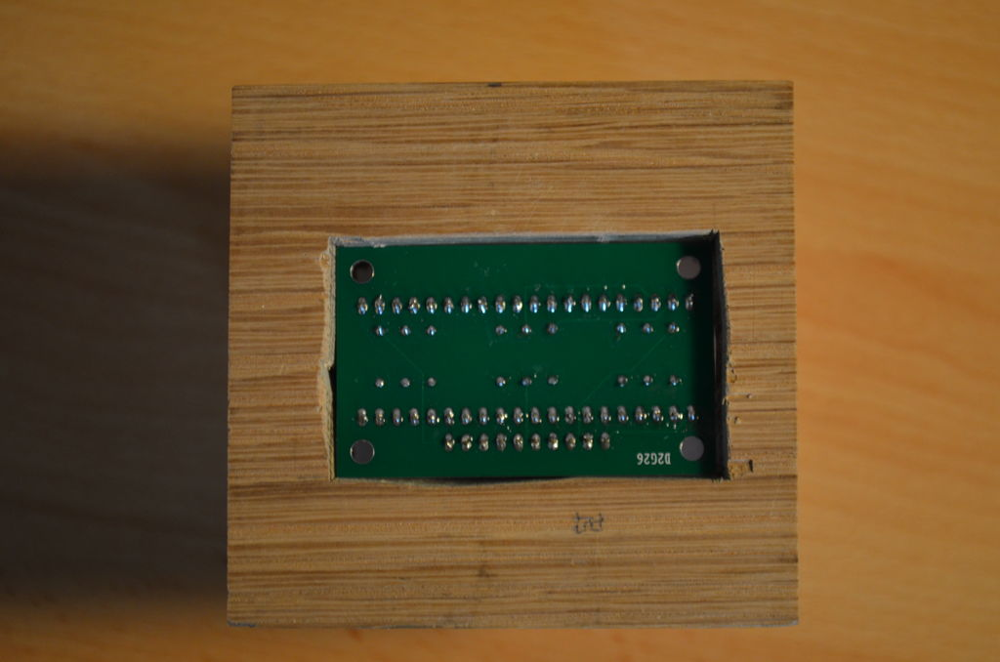
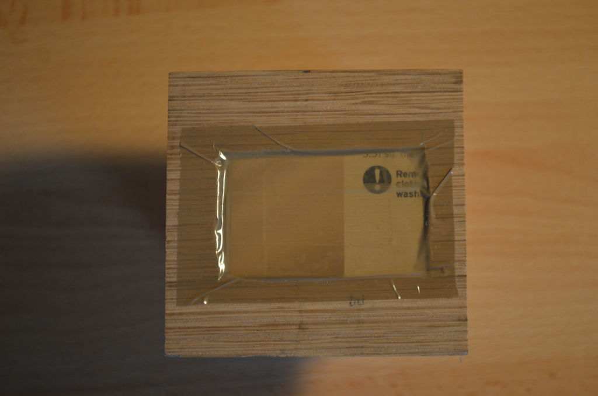

Finally, I popped the PCB inside and made sure that it lined up with the USB connector properly, then added some cardboard spacers and taped over the bottom with some parcel tape. It doesn’t need to be too well sealed as this won’t be seen. I might see if I can find some sticky rubber feet to put on later so that it doesn’t slide around the desk.

### Firmware

The firmware for the cube was written and uploaded using the [Arduino](www.arduino.cc) IDE with the [teensyduino](http://www.pjrc.com/teensy/teensyduino.html) plug-in installed. To make handling the serial commands easier, I downloaded and included the [SerialCommand Library](https://github.com/scogswell/ArduinoSerialCommand) which made dealing with the commands sent from the python script very simple.

I’ve now created a github repository for this project, simply download or clone from https://github.com/jpwsutton/gloCube and upload the gloCube.ino file from the firmware directory.

To use the running code, connect to the serial port and send one of two commands.

* `F <LED ID> <R value> <G value> <B value>` – This will fade the selected LED to the specified colour e.g. `F 0 255 0 0` will fade LED 0 to red.
* `L <Flash No.> <R value> <G value> <B value>` – This will flash all LEDs N number of times at the specified colour e.g. `L 5 0 255 0` Will flash all LEDs five times green.
 Software

To control the cube, I wrote several python scripts to manage overall connection and to check Facebook and Gmail for notifications. This code can also be seen in the python directory in https://github.com/jpwsutton/gloCube.

Instead of outlining each script here on the blog, I suggest that you read the README.md file and the source code to see how it works for yourself, this is because it is a constantly evolving project and I will be changing the structure and source code a number of times.

I hope that you found this interesting, If you have any questions regarding this build, please leave a comment and I will do my best to respond!

