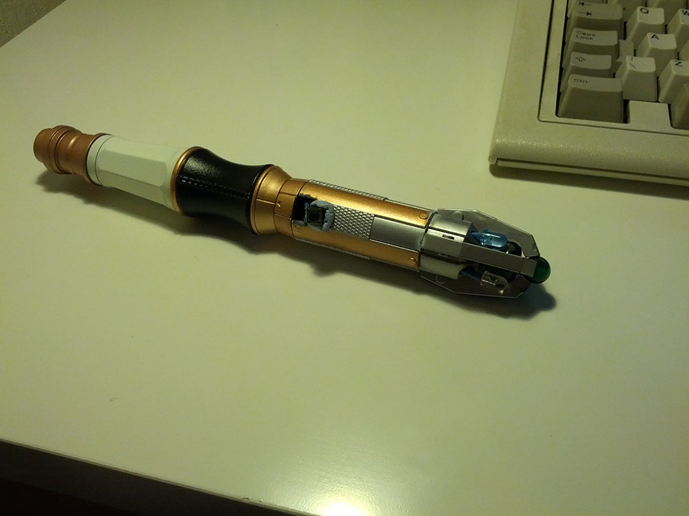

<!---->
As a distraction for my Dissertation, I thought I would make my own [TV-B-Gone](https://cornfieldelectronics.com/tvbgone/tvbg.home.php). The TV-B-Gone is a nifty little device which acts as a universal off switch for most popular Televisions and is actually pretty simple to make, alternatively you can buy them assembled or in kits from [online](http://www.makershed.com/products/super-tv-b-gone-kit-unassembled).

I decided that I wanted to make a very lightweight version that I could house inside a [sonic screwdriver toy](http://www.amazon.co.uk/Doctor-Who-Personalise-Sonic-Screwdriver/dp/B0056EO5IS/ref=sr_1_4?s=kids&ie=UTF8&qid=1360105922&sr=1-4) that I got last year. I used this [Instructable](http://www.instructables.com/id/350-DIY-TV-B-Gone-Mico/)  for a $3.50 “TV-B-Gone micro”, The design here is a bit too small for my liking, as it is small enough to fit on the footprint of a CR2032 battery.

The first step was to put the LED’s together, I used two wide beam IR LEDs and two narrow beam IR LEDs, soldering them together in parallel and then fitting them into the end of the screwdriver. Note: This will require breaking the screwdriver apart in order to access the insides.

I repeated this for all of the LEDs and then glued the head of the screwdriver together again.

Unfortunately, I didn’t take many photos of the rest of the build, however you can see below the finished circuit that contains the Attiny85v microprocessor, resistor, capacitor and resonator. I pretty much followed the Instructable word for word, except when it came to the layout of the components.

Overall, I think this worked out nicely, I’ve tried it on a few TVs around the house and it seems to work on most of them.

