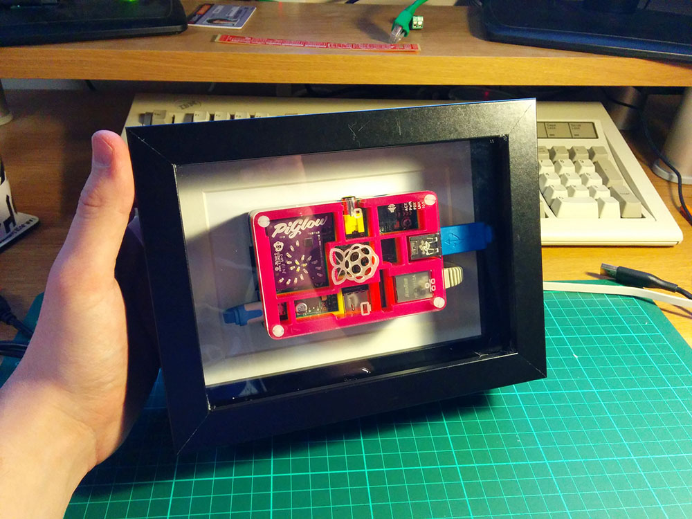
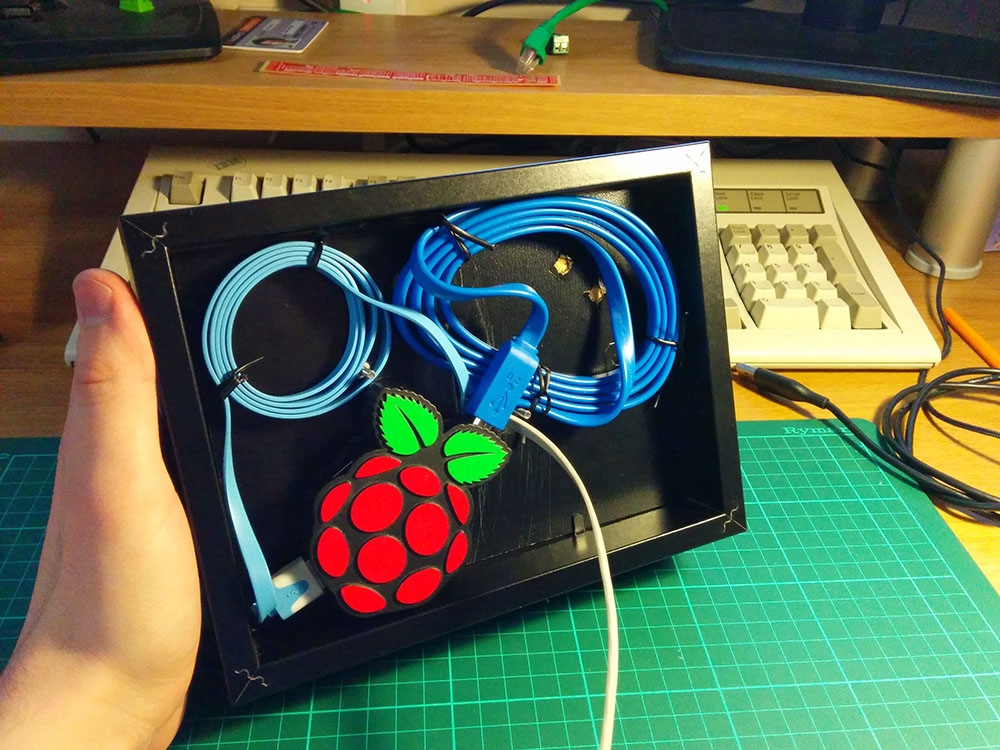

A while back, I purchased a Pimoroni [Pibow](http://shop.pimoroni.com/products/pibow-raspberry-pi-case) case for my raspberry pi as well as a [Piglow](http://shop.pimoroni.com/products/piglow) and a [Pihub](http://shop.pimoroni.com/products/pihub) (That’s a lot of Pi!). The first thing I thought was how awesome it all looked, especially the raspberry pi in it’s rainbow acrylic enclosure.

The only problem was that I was getting fed up of having wires scattered all across my desk every day. I did try a few cable management techniques, but nothing seemed to work. I also preferred having the pi on it’s side as that was the best way to view the PiGlow (Which I’m using as a binary clock, check out Boeeerb’s examples [here](https://github.com/Boeeerb/PiGlow)) while sitting at my desk.

I saw this [tutorial](http://www.ikeahackers.net/2013/06/digital-pi-cture-frame.html) on [ikeaHackers](http://www.ikeahackers.net/) and decided that it was exactly what I wanted to do for my own Pi. The only difference being that I wanted to mount the  PiHub in the frame as well.

Here is the finished result:

And here is how I mounted the Hub, It’s a bit hard to see, but I actually used two of the RIBBA Picture Frames and stuck them together using hot glue, then I mounted the Rpi on one side of the backing and the hub on the other, both parts are safely inside the edges of the double frame, and the Raspberry Pi is now looking even better!

