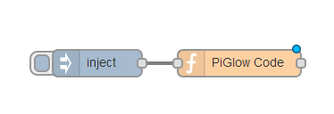
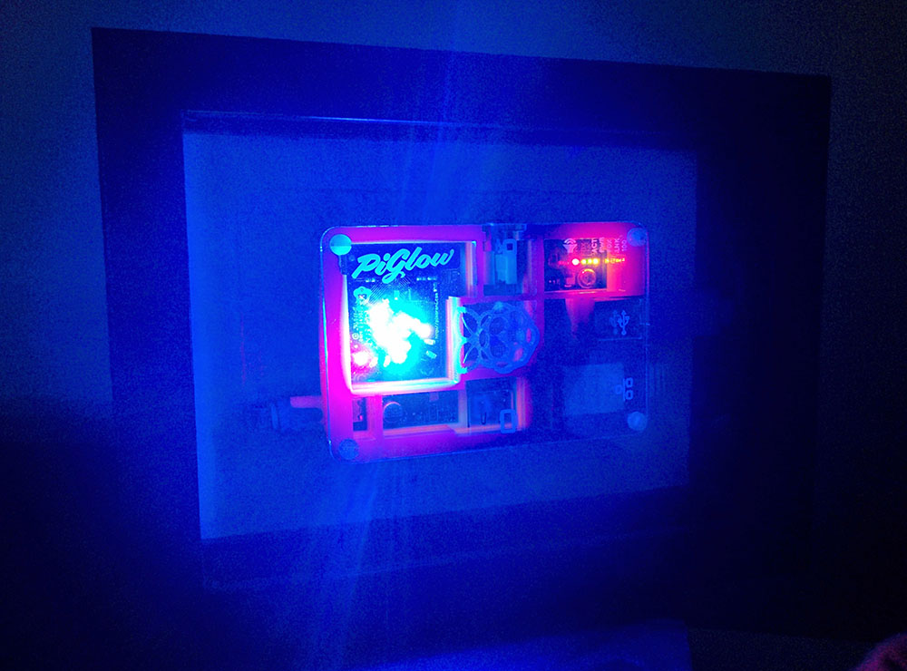

<!---->
My house mate is currently waiting to get his delivery of his new Raspberry Pi B+ and PiGlow, and as we were discussing this I thought it would be interesting to see if I could control a [PiGlow](http://shop.pimoroni.com/products/piglow) using [Node-Red](http://nodered.org/).

### Installing the PiGlow node module
<?prettify?>
```
sudo npm install piglow
```
This one speaks for itself really!

### Setting up Node-Red to use the module
<?prettify?>
```
functionGlobalContext: { piglow:require('piglow') }
```
Note: If you already have a module in your functionGlobalContext, add the piglow chunk after a comma e.g.:

<?prettify?>
```
functionGlobalContext: { crypto:require('crypto'),
                         piglow:require('piglow') }
``` 

###Hello World

Now, run node red as sudo:

sudo node red.js
Create a simple flow with an Inject Node going into a function node.



Now enter this basic javascript into the function node.

<?prettify?>
```
var piGlow = context.global.piglow;
    
//callback fires when board is initialized
piGlow(function(error, pi) {
    pi.random;
});

return msg;
```

Click deploy and then try clicking on the inject. Your PiGlow should now light up randomly!



### Have fun!

Now you can play with your PiGlow to your heart's content!

Check out the[PiGlow node module Git Page](https://github.com/zaphod1984/node-piglow) for instructions on how to control it!

