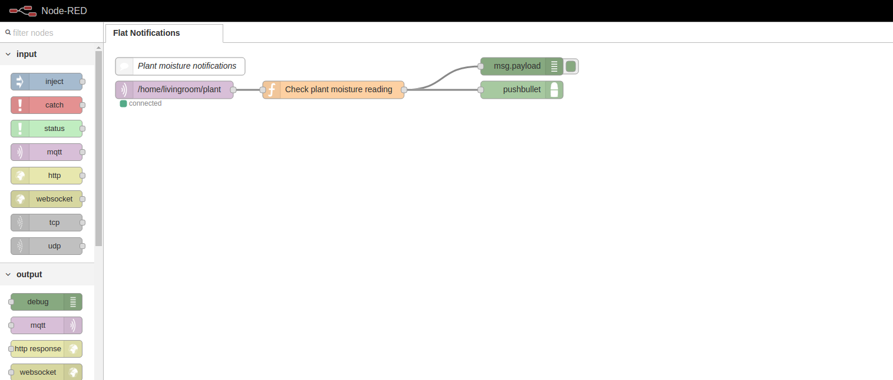
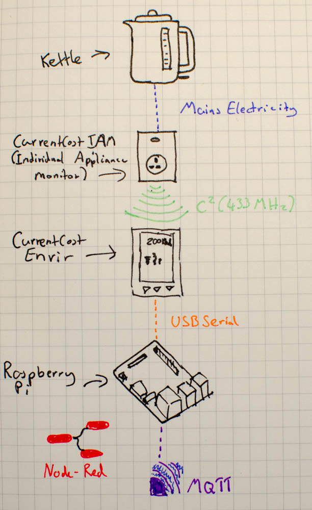
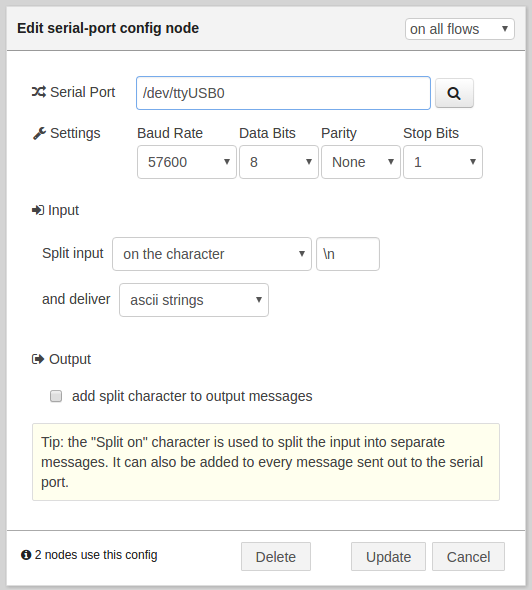
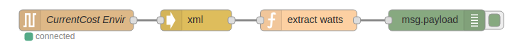

<!---->
Being British, I'm not ashamed to admit that I have a (completely healthy) obsession with Tea. It's probably not too much of a surprise then that one of the first things that I decided to hook up to the internet was my Kettle. Using some off the shelf parts, a Raspberry Pi and Node-Red I successfully hooked my kettle up to twitter so that it could take it's place among other pieces of technology that really don't have any business tweeting and is just another gratuitous use of the IoT.

<blockquote class="twitter-tweet" data-lang="en"><p lang="en" dir="ltr">I just boiled! Go get some tea! @ 2016-04-15T06:04:17.867Z, I just cost 0.11p</p>&mdash; IoT Kettle (@IoTKettle) <a href="https://twitter.com/IoTKettle/status/720855243248959488">April 15, 2016</a></blockquote>
<script async src="//platform.twitter.com/widgets.js" charset="utf-8"></script>

The design is actually pretty simple; I placed an energy monitor between the kettle and mains electricity so that I could monitor how much energy the kettle used. I then fed this data into Node-Red and created a flow that could detect when the kettle was being used and how much energy it consumed over the course of a boil. Then with help from some 'back of an envelope' maths, I could work out exactly how much that cup of tea cost to make (in energy terms of course). Once I'd gleaned this helpful titbit of knowledge, there was really only one place that it could sensibly go: [Twitter](https://twitter.com/IoTKettle). 

I was able to knock all that out over the course of an evening and left it at that. From it's birth on the 7th of January till April 14th 2016, it registered and tweeted about 632 boils of the kettle. For those wondering, over 97 days that means I averaged about 6 kettle boils, but as I was away for some of that time and that not every boil meant a cup of tea I think I probably consumed between 4 and 5 cups a day!

Then on the 16th of Apirl disaster struck. 123-reg who had been hosting my VPS for many years (and where my Node-Red instance had been running), had an incident where a badly written script deleted every single one of their VPS hosts and associated backups. Even worse, they were unable to restore any of my data. I learnt an important lesson that day: Just because it's not business critical, doesn't mean you'll hate yourself if its lost. Take Local Backups.

<blockquote class="twitter-tweet" data-lang="en-gb"><p lang="en" dir="ltr">Some customers may be experiencing issues. Our teams are working to resolve and a further update will be provided: <a href="https://t.co/37s8eWkhJ7">https://t.co/37s8eWkhJ7</a></p>&mdash; 123-reg (@123reg) <a href="https://twitter.com/123reg/status/721293507470745600">16 April 2016</a></blockquote>
<script async src="//platform.twitter.com/widgets.js" charset="utf-8"></script>
_Understatement of the year._

So now in May, with a new and shiny VPS hosted by [Mythic Beasts](https://www.mythic-beasts.com/) and my first free weekend in what seems like forever, I am slowly re-building my Node-Red flows to automate my flat!


_At least I had something backed up (on this blog... on Wayback machine)_

### Starting from scratch

So as they say: if it ain't broke, don't fix it. With that in mind, I'm going to leave the general architecture exactly the same as before: The kettle is plugged into a [CurrentCost IAM (Individual Appliance Monitor)](http://www.currentcost.com/product-iams.html) that sends the energy usage to it's base station; the [CurrentCost EnviR](http://www.currentcost.com/product-envir.html). This is then connected to a [Raspberry Pi 2 Model B](https://www.raspberrypi.org/products/raspberry-pi-2-model-b/) using the included USB Serial cable (CurrentCost are amazing for including this with the EnviR, It's likely this is what made it such a hit with the home energy hacking community!). The Raspberry Pi is then running [Node-Red](http://nodered.org/) which is listening to the USB serial connection and parsing the incoming data. The energy usage data is the published to a topic specific to the kettle on my MQTT broker e.g. /home/kitchen/kettle.



In this case I'm then using a different Node-Red instance that lives on my personal VPS to then process this data, but you could just as easily use the same Node-Red running on the Pi to process the readings. The flow subscribes to the kettle topic and listens for a value greater than 0 (As when the kettle isn't doing anything it is consuming 0 watts). Once a reading greater than 0 is detected , the flow stores the incoming readings in an array and continues to do so until the usage returns to 0 watts. The flow then Averages the values to get a rough estimate of how many watts were consumed to boil the kettle. Finally, some 'back of the envelope' maths is used to calculate how much money it cost by using the 'pence per kWh' value that my energy company provides me with on my bill.

Once we've worked out how much it cost, it's then just a simple matter of using the Twitter node in Node-Red to send out a helpful tweet so that the universe knows how much my cup of tea cost to make. Simple!

#### Getting the Energy usage out of the EnviR

Once you've plugged the EnviR into your Raspberry Pi (Or other computer running Node-Red), you'll need to build your flow to get the readings from the USB serial connection. Drag a serial-in node onto your canvas and open the configuration for a new Serial Port. The most important thing is to find out what serial port the Pi has allocated for the USB serial cable. In my case it was `/dev/ttyUSB0`, but you should just be able to click on the magnifying glass to get a list of valid ports to choose from, if you've only got one USB serial cable attached, there should be only one in the list.



Follow the configuration shown above, it's important to get the Split input settings right so that you get nicely separated messages for Node-Red to parse.



Then you'll need an XML parsing node, this takes the XML output from the serial node and packages it in a nice json object for us! (I still have nightmares about parsing XML in perl from the first time I started using this energy monitor back in 2011, Node-Red is amazing.)

Finally we need to extract the useful information from the XML node, add a function node and copy in the code below:

<?prettify?>
```
/* sample message
(Object) {
 "msg": {
  "src": ["CC128-v0.11"],
  "dsb": ["00600"],
  "time": ["19:04:49"],
  "tmpr": ["18.3"],
  "sensor": ["0"],
  "id": ["02902"],
  "type": ["1"],
  "ch1": [{"watts": ["00023"]}]
 }
}
*/

var reading = msg.payload;

//ignore if history packet
if(reading.msg.hist){return null;}

msg.payload = {};
msg.payload.sensor = reading.msg.sensor[0]*1;
// This is the temperature of the EnviR base station, not the sensor.
msg.payload.temperature = reading.msg.tmpr[0]*1; 
msg.payload.watts = reading.msg.ch1[0].watts[0]*1;

return msg;
```

Now you'll be getting a message for every sensor that is paired with the EnviR base station. Normally 0 will be the 'main' sensor that is clamped around your homes electricity connection at the meter. Then sensors 1 to 10 will be any IAMs that you have connected. It shouldn't be too tricky to figure out which sensor is the right one by using some trial and error.

You can grab the flow from the Node-Red flows site here: [http://flows.nodered.org/flow/710da5d8a7038caa06c0f4c23062b03f](http://flows.nodered.org/flow/710da5d8a7038caa06c0f4c23062b03f)

Finally you just need to pop in an MQTT node to publish to your chosen topic, or just carry on building the rest of the flow.

#### Monitoring the kettle state and usage

Now that we're getting regular updates from our kettle, we need to detect when the kettle has started boiling and then record the energy usage during this period.
Note: To test this, I replaced the kettle with an energy saving lamp and a remote control socket. This meant that I could play around with the code without racking up huge energy bills or getting up from my chair!

Create a function node that receives the messages coming from the previous flow (either directly, or through an MQTT subscribe node). Inside that function node copy the code below:

<?prettify?>
```
var value = msg.payload.watts;
msg.payload = {};
// Get the previous state (if no state yet, assume false)
var currentState = flow.get('kettleCurrentState') || false;

// Sometimes the reading isn't always 0 due to interference
// from other appliances but 5 watts seems to be a good 'low filter'
if(value > 5){
    // Kettle is ON
    // Set state to on if it isnt already
    if(currentState === false){
        flow.set('kettleCurrentState', true);
        flow.set('kettleStartTime', new Date());
    }
    // Append current watts value to array
    var kettleArray = flow.get('kettleArray') || [];
    kettleArray.push(value);
    flow.set('kettleArray', kettleArray);
}else{
    // Kettle is OFF
    if(currentState === true){
        // The kettle has just powered off
        flow.set('kettleCurrentState', false);
        
        // Add Start and Stop times to payload
        msg.payload.stopTime = new Date();
        msg.payload.startTime = flow.get('kettleStartTime');
        
        // Now that the kettle has boiled,
        // we need to average the usage array
        var usageArray = flow.get('kettleArray');
        
        var sum = 0;
        for( var i = 0; i < usageArray.length; i++ ){
            sum += parseInt( usageArray[i], 10 ); //don't forget to add the base
        }
        
        var avg = sum/usageArray.length;
        // Add average usage to payload
        msg.payload.averageUsage = avg;
        // Reset usage array
        flow.set('kettleArray', []);
        return msg;
        
    }

}
```
Hopefully it's fairly self explanatory, the node listens for a value, if it's above 5 watts (a low pass filter to cut out any interference that the IAM sometimes picks up from other appliances) then it makes sure that the 'kettleCurrentState' is set to true. It also adds the current value to an array. If the kettleCurrentState was previously false, it also adds the kettleStartTime timestamp.

If the value is below 5, we assume that the kettle is either not boiling, or has stopped boiling. If the 'kettleCurrentState' is true, we know that we were just boiling. The function then sets 'kettleCurrentState' to false and adds the startTime, and stopTime to the payload. It also takes the array of values and sums and averages them before adding them to the payload. The Array is then reset as well. The message is only returned once this has happened, so we can be sure in the next node that any incoming messages are the result of a full boil cycle.


#### Calculating how much that boil cost

I created another node to calculate the Kilowatt hours that were used to boil the kettle. The formula is actually fairly straightforward.

E<sub>(kWh)</sub> = (P<sub>(W)</sub> x t<sub>(hr)</sub>) / 1000

Once I did that, I passed it onto the next node.

<?prettify?>
```
// In order to calculate the kWh value we need
// the following formula:
// E = (P x t) / 1000
// E is kWh
// P is Watts
// t is time in hours

var startTime = new Date(msg.payload.startTime);
var stopTime  = new Date(msg.payload.stopTime);

var power = msg.payload.averageUsage;

// Get time in seconds:
var timeDiff = Math.abs(stopTime.getTime() - startTime.getTime()) / 1000;
// Convert to hours
var time = timeDiff /  3600;

var energy = (power * time) / 1000;

msg.payload = {};
msg.payload.stopTime = stopTime;
msg.payload.energy = energy;

return msg;
```

After a quick check on my Electricity bills, I found that I am currently paying 10.82p/kWh. I'll ignore the standing charge, as that is something I pay every day regardless of whether or not I boil the kettle. So all that we have to do now is multiply the consumed kWh from our previous node by our rate and we'll have the cost for our cuppa! (Warning, it will likely be a very small number!).

<?prettify?>
```
var teaQuotes = [
    "Where there’s tea, there’s hope.",
    "A cup of tea would restore my normality.",
    "Computer: Tea. Earl Gray. Hot.",
    "Make tea not war.",
    "I’m a little teapot, short and stout.",
    "Never trust a man who, when left alone in a room with a tea cozy, doesn't try it on."
    ];

// Price per kWh in pence
var energyRate = 10.82;

// Get price of boil in pence
var boilCost = (msg.payload.energy * energyRate).toFixed(2);


// Tweet Text
var chosenQuote = '"' + teaQuotes[Math.floor(Math.random() * teaQuotes.length)] + '"';
var tweet = chosenQuote + ' This boil cost: ' + boilCost + 'p';
var size = tweet.length;
msg.payload = tweet;
return msg;
```

Whilst I was writing this, I thought I'd also like to add a random tea related quote to each tweet which I think works quite nicely. Once you've added this final function node, all you need to do is add a Twitter node, authorise it with your Twitter account and you're ready to go. Pop the kettle on and wait to see your tea consumption habits broadcast to the world!

<blockquote class="twitter-tweet" data-lang="en"><p lang="en" dir="ltr">&quot;Computer: Tea. Earl Gray. Hot.&quot; This boil cost: 0.75p</p>&mdash; IoT Kettle (@IoTKettle) <a href="https://twitter.com/IoTKettle/status/731866250742272000">May 15, 2016</a></blockquote>
<script async src="//platform.twitter.com/widgets.js" charset="utf-8"></script>

Hopefully that was simple enough to follow, I designed this system to be fairly modular so it should be fairly easy to use parts of it for other tasks, and of course, you don't need to just monitor your kettle. 

A possible adaptation that would be quite cool would be to monitor your washing machine, if you had a flow meter handy that you could install in the water inlet you could monitor both Electricity and Water usage!

If you fancy stalking my tea making habits, go ahead and follow [@IoTKettle](https://twitter.com/IoTKettle), but that would be just weird!

