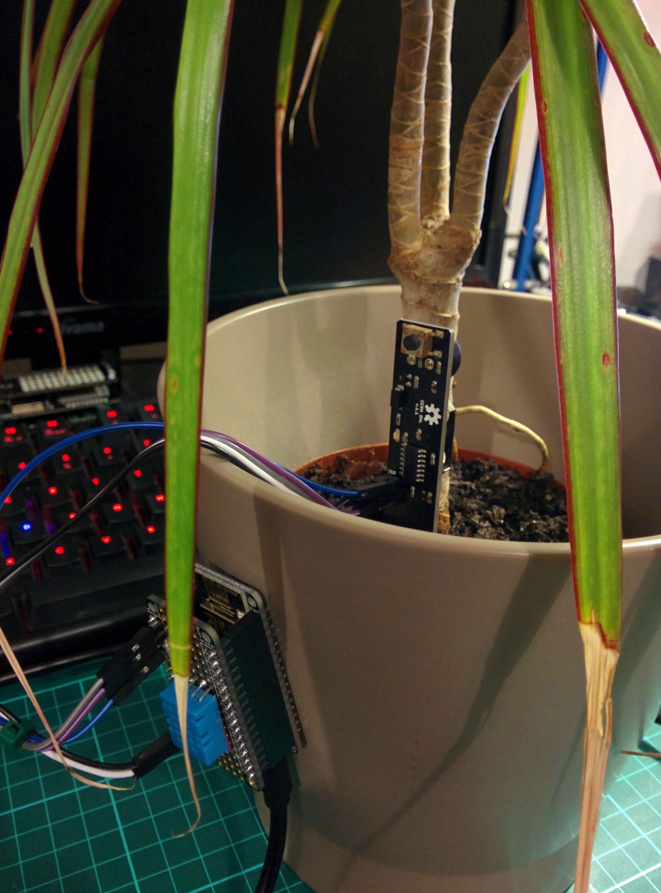
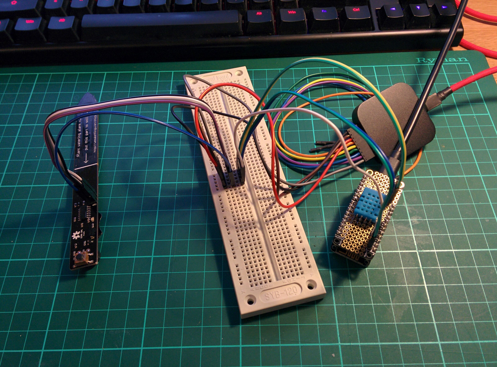
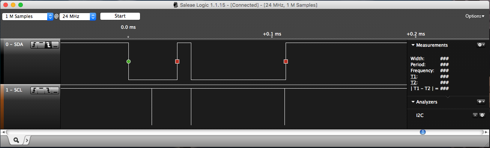
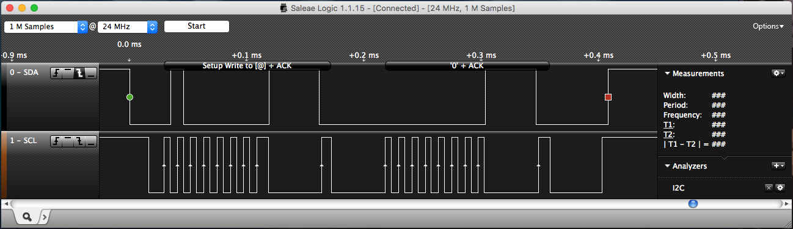
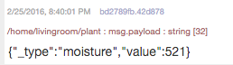
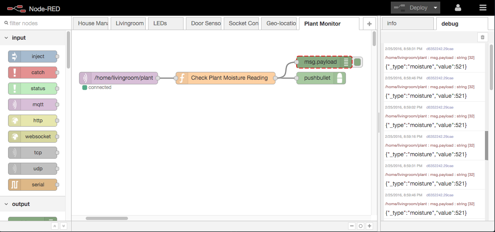
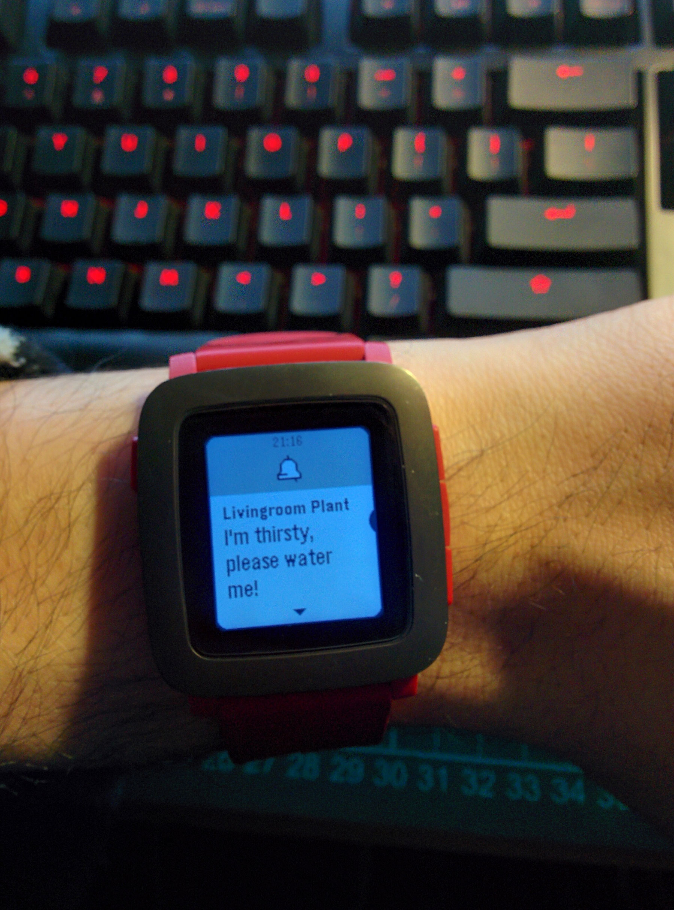

<!---->
About six months ago I was able to change my role at the company that I work for. Whilst still being a software developer, I'm very lucky to now be working on something that I've been interested in for a long time. I'm now a developer for the Open Source [Eclipse Paho](http://www.eclipse.org/paho/) Project and as of very recently I became an official committer for it! 

The goal of the Eclipse Paho project is to provide open source client implementations of [MQTT and MQTT-SN](http://mqtt.org/) for all major (and some minor) languages and architectures. From C and Java to newer languages like Go. Embedded devices are also covered with our embedded-c client which has been designed to be pluggable so that it can be quickly made compatible with new hardware as the need arises.

MQTT has been an important part of my hobby for the past few years as I've slowly connected more and more things up to it to automate parts of my life and collect data. I've had a few projects using MQTT that I kept meaning to write up, but never got round to it (as usual!), so first up is my MQTT powered Plant and environment monitor!

The title really says it all, but here's what I've built:



Yes, incase you couldn't tell, the plant does need watering! Making this project even more important!

## What it does

In the pot itself is a really handy soil moisture sensor called Chirp which was created by [@Miceuz](https://twitter.com/miceuz) over at [wemakethings.net/chirp](http://wemakethings.net/chirp/). I actually brought this as a standalone sensor a few years ago. The idea is that you set a 'good' moisture level by pressing the button, then when the soil moisture drops below a that level, the small speaker lets off little 'chirps' every now and again to let you know that the plant needs watering. A huge bonus of this particular sensor is that it's a capacitive sensor as opposed to a resistive sensor, meaning that "it does not make an electric contact with the soil, avoiding electrode corrosion and soil electrolysis and resulting in better accuracy and longer battery life". This was particularly useful as I had tried before with some cheap resistive sensors off ebay that never really worked properly.

Another huge bonus of Chirp is that it's 100% open source and very hackable! The I2C header on the side was exactly what I needed to get an accurate sensor reading whenever I wanted! You can actually buy a version of Chirp that is stripped down and doesn't have the speaker or button, it's slightly cheaper as well! I think when I get round of setting up my next plant to monitor, I'll definitely get one of these as I've no need for the speaker any more.

On the side of the pot is an Adafrit Feather HUZZAH which is powered by the good ol' ESP8266. Stacked on top is a small feather protoboard with a DHT11 soldered on.

As there is still a fair bit of space left on the feather, I can probably add on some more sensors in the future, maybe a PIR sensor to detect if someone is in the room?

The ESP8266 is running code written and uploaded from the Arduino IDE using the Eclipse Paho Embedded C client: github.com/eclipse/paho.mqtt.embedded-c to publish the soil moisture, temperature and humidity every minute to my private MQTT broker which is running Eclipse Mosquitto: eclipse.org/mosquitto. From there I'm using Node-RED to monitor the moisture level in the plant pot and send me an alert if it gets too low.

#### Getting a good reading from the Chirp

As if making the Chirp open source wasn't great already, the authors decided to add some example code for anybody wanting to use the Chirp as a sensor in a larger system as well. The code (found here: wemakethings.net/chirp) is pretty simple, when you want to get a reading from the moisture sensor, just call readI2CRegister16bit(0x20, 0) and you should get an integer between 100 and 600 representing the moisture content in the soil (It might be different for other people, so worth experimenting and calibrating your code).

Unfortunately I found that when running the code on the ESP8266, the chirp wouldn't always receive the I2C command and so would keep chirping away with no data coming through to the ESP8266.

Out comes the trusty logic analyser to see what's going on under the hood. Normally I'd just use the little grippy probes that came with it to hook into the data and ground lines, but alas it was all just a bit fiddly and kept falling apart. So I built a little Man-in-the-Middle rig that was much better:



I was actually so impressed with how well this worked, that I'm thinking of using some protoboard to build a more permanent version of this with an array of different header types to hook into different kinds of wires. Might even do another post on it!

Once I started seeing what was going on, it was fairly obvious that the Chirp wasn't recognising the start of the I2C command from the ESP8266. I noticed though when I hit the button it would sometimes kick into life.. Hmmm timing?



The header on the Chirp isn't just an I2C connector, it's actually a full ISP header for programming the little ATTINY44A onboard, which mean's there's a RESET pin! I tried manually resetting it a few times with a spare jumper and found that was the key to getting it working. Once I was sure that it would work, I changed my Arduino sketch to be able to reset the Chirp if it got an invalid reading back (When it wasn't working, the I2C code would return -1).

<?prettify?>
```
unsigned int readI2CRegister16bit(int addr, int reg) {  
  Wire.beginTransmission(addr);
  Wire.write(reg);
  Wire.endTransmission();
  delay(1100);
  Wire.requestFrom(addr, 2);
  unsigned int t = Wire.read() << 8;
  t = t | Wire.read();
  return t;
}

unsigned int getMoistureReading(){  
  int moistureVal = readI2CRegister16bit(0x20, 0);
  while(moistureVal == -1){
    delay(500);
    Serial.println("Bad reading from chirp, resetting...");
    // Chirp is not responding, reset
    digitalWrite(CHIRPRESETPIN, LOW); 
    delay(500);
    digitalWrite(CHIRPRESETPIN, HIGH); 
    delay(500);
    moistureVal = readI2CRegister16bit(0x20, 0);
  }

  while(moistureVal == 65535){
    moistureVal = readI2CRegister16bit(0x20, 0);
  }
  return moistureVal;
}

void publishUpdate(){  
...
 int moistureVal = getMoistureReading();
 String plantPayload = "{\"_type\":\"moisture\",\"value\":";
 plantPayload += moistureVal;
 plantPayload += "}";
...

}
```




 That's better!

The full sketch can be found on my GitHub account, here: [github.com/jpwsutton/plantMonitor](https://github.com/jpwsutton/plantMonitor)

## Sending alerts with Node-RED

Sending the moisture reading is only half the battle, the main aim of this project was to be able to get sent an alert once the moisture level dropped below an acceptable level. Fortunately Node-RED is perfect for this, it has MQTT functionality baked in as standard, and there are lots of handy third party nodes out there that can send you messages e.g. Twillio, Pushover, Pushbullet, email etc..

I opted to go with PushBullet as I was already using it for another alert in Node-Red. It's really easy to install, just cd to the Node-RED home directory (usually in ~/.node-red) and run this npm command: npm install node-red-node-pushbullet

How it should work: 
1. When a message arrives, check that it is over the target value, if not continue: 
2. Check that we've not already sent an alert today (We don't want it to be annoying!) 
3. Check that it's not night time (Nothing is more annoying than being woken up at 3am because your baby plant wants a drink) 
4. Send a message using Pushbullet and set a flag to say that we've sent a notification today.

#### Node-RED flow



 As you can see, this is a pretty simple flow, on the far left in the purple is the MQTT subscription node that has subscribed to the topic that the ESP8266 is publishing to /home/livingroom/plant. That node feeds into a function node that will execute some JavaScript on the incoming message and then sends it's output onto the PushBullet Node as well as a debug node.

Note: 
As with any programming language or tool there are always many ways of doing things. This is especially true of Node-RED, in this case I'm more comfortable just doing everything in the Function node. However for someone who's just starting out in programming, there are many other nodes in Node-RED which can be used to accomplish parts of the task which may be easier to understand e.g. the switch node.

Function node code 
Below is the code that I've written in the function node to filter the incoming messages and generate alerts if the value is too low.

<?prettify?>
```
// Prototype to reset dates to 00:00:00
Date.prototype.withoutTime = function () {  
    var d = new Date(this);
    d.setHours(0, 0, 0, 0, 0);
    return d
}

// Function to validate if a time is within a set range
function validate_time(time,startTime,endTime){  
       time = time.split(/:/);
       startTime = startTime.split(/:/);
       endTime = endTime.split(/:/);
       return !(time[0] < startTime[0] 
            || time[0] > endTime[0] 
            || (time[0] == startTime[0] && time[1] < startTime[1])
            || (time[0] == endTime[0] && time[1] > endTime[1]));
}

// If the moisture value is below 250
if(msg.payload.value < 250){  
    // Get the lastAlertDate from the node's context or set it as Epoch
    var lastAlertDate = context.get('lastAlertDate')|| new Date(0).withoutTime();
    // If the last update was before today
    if(lastAlertDate < new Date().withoutTime()){
        var now = new Date();
        // Builds a 'xx:xx' time from the date, if the hour or minute is only 1 digit, adds a 0 to front
        var currentTime = (('0' + now.getHours()).slice(-2) ) + ":" + ('0' + now.getMinutes()).slice(-2) ;
        // The times between which alerts can be sent
        var startTime = "07:00";
        var endTime = "23:30";
        // If it is currently 'daytime'
        if(validate_time(currentTime, startTime, endTime)){
            // Update lastAlertDate to today as we're sending a message
            context.set('lastAlertDate',new Date().withoutTime());
            // Create and send a notification message
            var output = {};
            output.payload = "I'm thirsty, please water me!";
            output.topic = "Livingroom Plant";
            return output;
        }
    } 
}
```

A cool bonus is that if you've got a Pebble or other brand of smart watch, the PushBullet notifications will go straight to your wrist! 



And there we go!

Of course, I've not really mentioned the DHT11 temperature and humidity sensor that's also hooked up, this is also publishing to my MQTT broker. The data is being stored in a database by a handy app that I've written which also generates some nice graphs for it. Hopefully I'll talk about that in more detail in another post!

