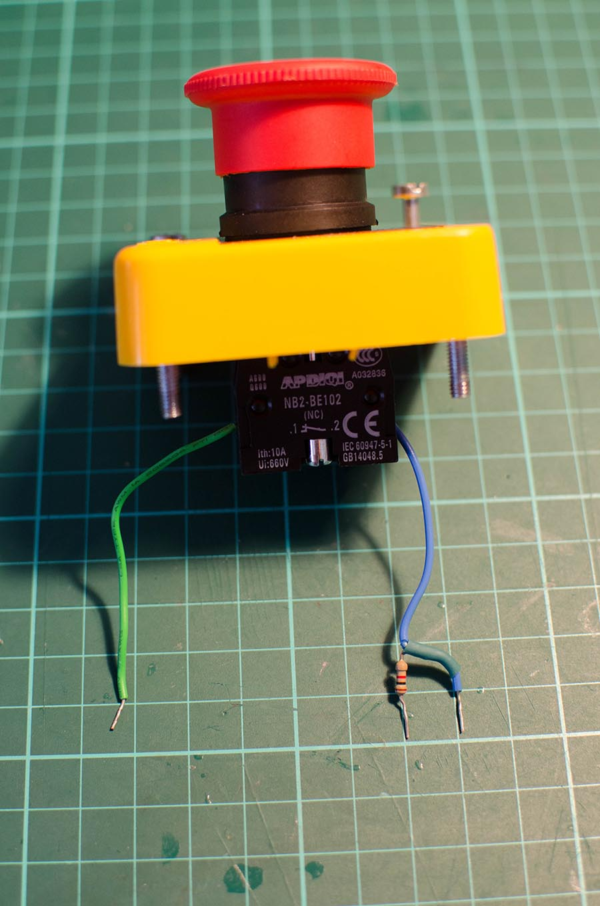
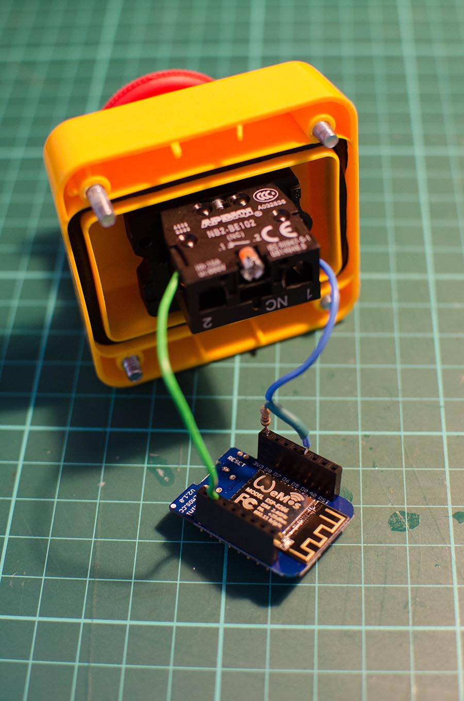
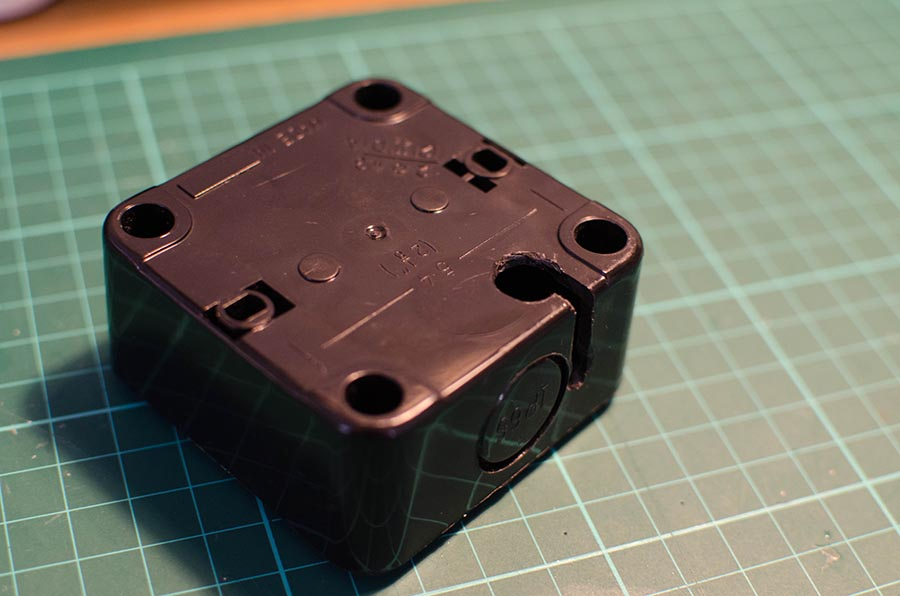
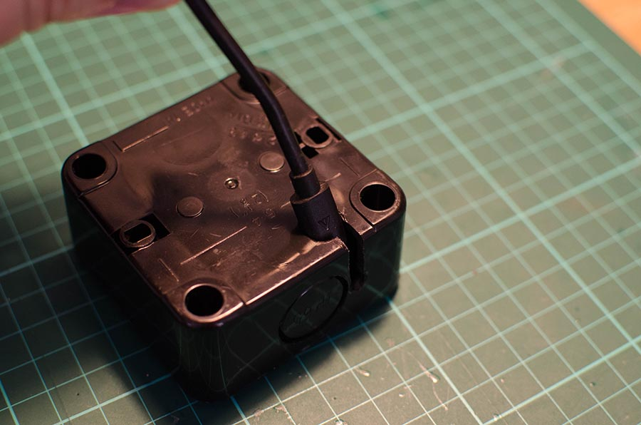
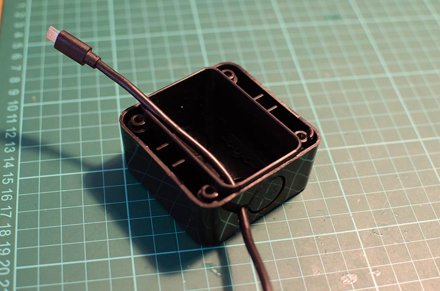
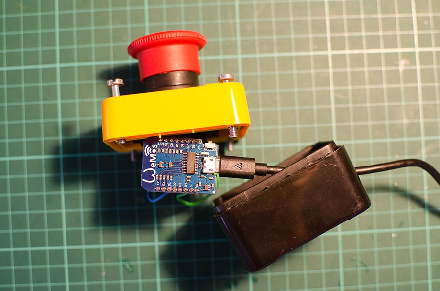

A few years ago, I saw that you can buy these rather cool looking "Emergency Stop" buttons off the internet. It was one of those purchases you make before actually working out what you want to do with it, but at just a few quid it was hard to say no to. Fortunately, inspiration came rather quickly and within a couple of hours of it turning up on my doorstep I had a pretty nifty 1-key USB keyboard (Using a Teensy) that would send a custom keyboard combination whenever the button was pressed. For a few years, I used this as my "Epic Lock screen" button that made the act of locking my computer and going for lunch even more awesome. That was all so 2012 though, now that we're in 2017, I felt that I should really upgrade with some MQTT goodness.

The original button was still working fine and still does a good job of locking my computer, so I wanted to leave that one alone and build something new. After a few minutes searching the web, I was able to find almost the exact same button so got that (Similar buttons found [here](https://www.amazon.co.uk/Waterproof-Emergency-Button-Normally-HRUS/dp/B01C1112F2/ref=sr_1_44?ie=UTF8&qid=1496581676&sr=8-44&keywords=Emergency+Stop+Push+Button)).

Next up was the brains of the operation, I've found that the ESP8266 has been absolutely fantastic when it comes to building cheap and quick Internet connected projects. I've used it in a number of projects around my home, including the [IoT Plant Monitor](/posts/2016/monitoring-houseplants-with-mqtt-and-the-esp8266/). In the past, I've used plain ESP8266 chips as well as the [Adafruit HUZZAH breakout](https://www.adafruit.com/product/2471) and the [Adafruit Feather HUZZAH](https://www.adafruit.com/product/2821), all of which worked pretty well. However I was interested to try the [Wemos D1 Mini](https://wiki.wemos.cc/products:d1:d1_mini) which I had heard some very good things about from [@andysc](https://twitter.com/andysc) and also [@DrLucyRogers](https://twitter.com/DrLucyRogers) in [this cool instructables](http://www.instructables.com/id/Connect-Your-Thing-to-the-Cloud-for-Less-Than-4/).

##The Build

The Button that I brought is a Normally Closed locking switch, this means that in it's "normal" state, current is allowed to flow through it. When pressed (Usually in an emergency), it locks in the Open state. This makes sense given the task that these buttons are usually used for e.g. Stopping heavy / dangerous machinery if something goes wrong, all a person has to do is hit the button and power is cut.

However, this isn't exactly what we need our button to do, some quick surgery with a screwdriver removes the locking ability and the help of a pull-up resistor allows us to monitor whether the button is being pressed or not. For those who don't know what pull-up resistors are used for or why they are necessary, I recommend that you take a look at this excellent [SparkFun Article](https://learn.sparkfun.com/tutorials/pull-up-resistors). For reference, the Resistor I'm using is 1k Ohms 5% which does the job nicely.

As this is a very simple circuit and I wanted to save as much space as possible. I used a knife to shave some insulation off the blue wire where I then soldered one leg of the resistor onto before adding some heat shrink to keep everything tidy.

I then plugged the resistor into the 3v3 pin on the Wemos, the blue wire into the D5 digital pin and the green wire into GND.

And that's it for the build.. almost, I still needed to power the Wemos and there isn't quite enough space for a battery inside the button casing. The problem is that I also didn't want a massive hole in the side for the USB micro cable to come out of as if pulled it could unplug from the Wemos or cause some damage to the connector.

To work around this, I drilled a hole large enough for the connector in the bottom of the enclosure, and then a hole large enough for the cable itself on the side where I wanted it to come out. I then used my Dremel to cut a groove between the two holes. This means that I can push the cable through from the bottom, but then bring the wire itself out of the side of the box. The size of the connector prevents it from being pulled out of the enclosure as it can't fit through the small hole.

##The code

The code for this is pretty simple, Once connected to the Wifi, it sends a "Hello World" message to a topic on the MQTT broker it has connected to. It then waits in a loop for the button to be pressed, Once pressed, it sends a simple "1" to the same topic. Of course this was what I needed for my particular needs, however you could change these values / topics to anything you would like.

You may have noticed that I'm using the Adafruit MQTT client in this particular sketch. This isn't for any particular reason other than I fancied trying it out to see what it could do. I usually use the Eclipse Paho clients in my projects, but every once in a while it's nice to see what other people in the community are doing!

##What next?

At this point, you should now have a Button that sends a simple MQTT message every time the button is pressed. Now for the tricky bit, what to do with it!
In my case, I'm going to use Node-Red to subscribe to this MQTT topic and to send a payload to a [dashing.io](http://dashing.io/) dashboard that I've got set up with the [Time since last](https://gist.github.com/hannesfostie/5420959) widget. When the button is pressed, the time since returns to 0. Whilst this doesn't have any practical use just yet, it's a fun way to add some interactivity to our Dashboards and is reminiscent of the [Reddit April Fools joke from 2016](https://www.reddit.com/r/thebutton/)

