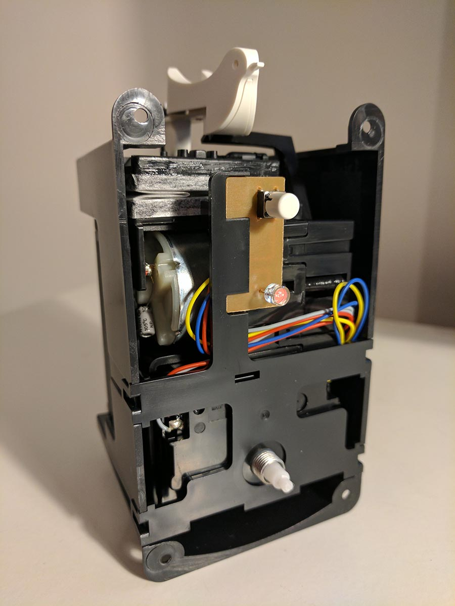
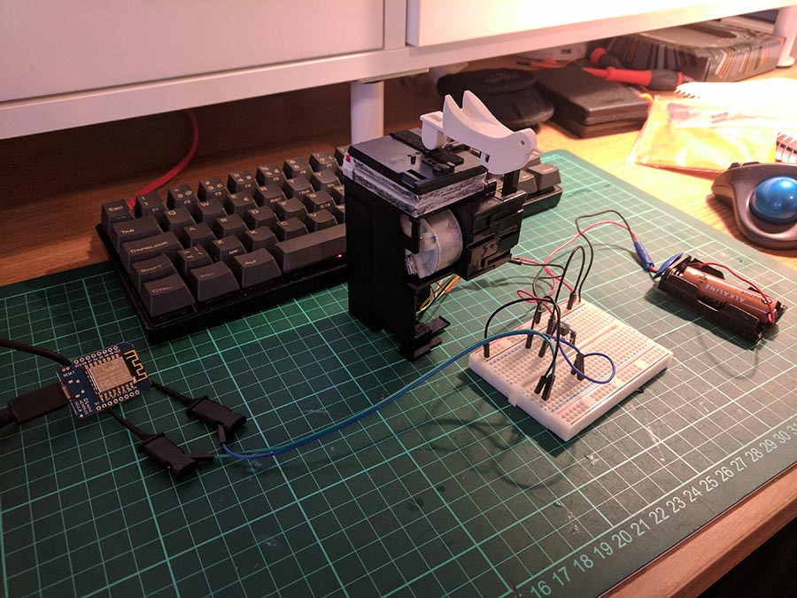
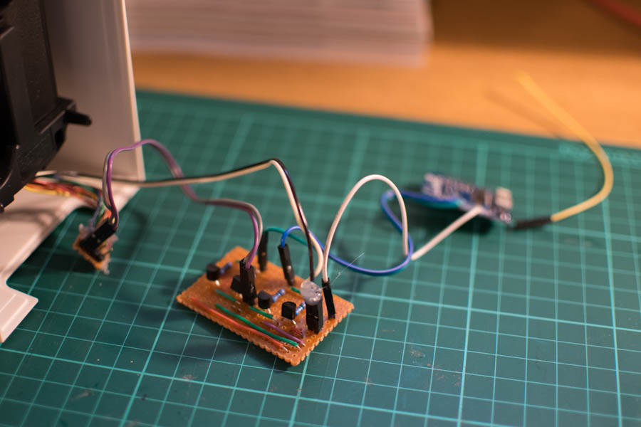
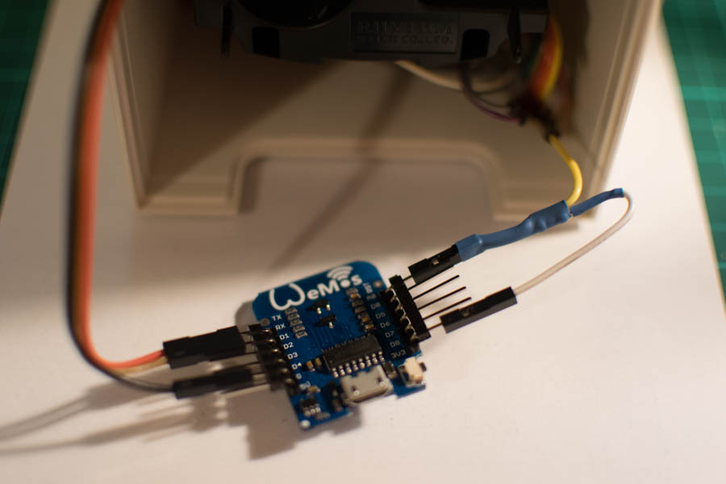

---
categories:
- mqtt
- cuckoo clock
- iot
date: "2017-11-10T22:14:19Z"
description: ""
draft: false
cover:
  image: cover.jpg
slug: tweeting-for-real
summary: In this post, I take a minimalistic Cuckoo clock and for better or for worse
  connect it to the internet.
tags:
- mqtt
- cuckoo clock
- iot
title: Building a Twitter Connected Cuckoo Clock... Really
---

I'm quite a fan of the Japanese Homeware company [Muji](www.muji.com/uk/), and so will take advantage of any chance I get to pop into one of the many stores dotted around London to have a browse. One product that they've been selling for quite a while is a minimalistic [Cuckoo clock](https://www.muji.eu/pages/online.asp?Sec=6&Sub=28&PID=7809). I was quite surprised that anybody still sells Cuckoo clocks, and thought it was just a bit of novelty, but once I pressed the demo button on the front, something just clicked and I knew that I wanted one and I knew exactly what I wanted to do to it. Fast forward several years and I finally brought one, rushed it home and immediately dismantled it. The little bird inside was never destined to tell the time, it's purpose in life would instead be a lot more fun (and yes, probably useless).

A few years ago I saw a promotion where a laser cutting studio built some one off twitter notification gadgets on the behalf of twitter for some users (I think). They looked like cuckoo clocks, but were just a servo connected to a small lasercut bird which would pop out every time they recieved a Like, reply or DM. I thought this was a cool idea, but thought that the lack of the "cuckoo" noise and the little bob that the bird did was a bit of a shame.

## The Plan

The plan is pretty simple, the clock itself has a perfectly working cuckoo mechanism and even a small demo button that can trigger the bird to cuckoo. I initially thought that I could just hook up my circuit to the button, however when the button is pressed, the bird will chirp the 12-hour time which if it's near midday or midnight will be a bit tiresome. Instead, I decided to hook directly into the motor that controls it with my own low voltage motor driver (The entire clock is powered by a 1.5v AA battery). With the original controller ignored, the cuckoo mechanism can be broken down into two parts: The bi-directional motor, and the limit switch.

The cuckoo mechanism is actually very well made, when the motor turns one way, the bird pops out of the front of the clock and starts bobbing up and down, whilst the bellows produce the chirps in time. If the motor runs backwards, the bird is then pulled back into the clock ready for the next use. The limit switch is used by the controller to know where the bird and the bellows are in the animation. The last thing we would want is for the bird to retract halfway through a cuckoo, leaving the next animation half done as well. This means that I need to hook my controller up to an H-Bridge motor controller as well as the limit switch so that I know when to reverse the motor.

*The internals of the cuckoo clock.*

The goal is to be able to make the bird run one animation cycle (i.e. to cuckoo once) every time an 'event' happens on my twitter account. I also ideally would like the clock to be as wireless as possible and for the clock component to continue working as I still would like to tell the time! To do this, I'm going to use a WeMos D1 Mini ESP8266 chip again as they have proven to be very reliable at running simple tasks and work with MQTT nicely as well. The ESP8266 also uses relatively little power and so could probably be powered off a rechargable 5v battery pack for a decent amount of time, failing this, only one 5v USB cable will be needed for power which can be tided away easially.

I will then use a Node-Red instance that's already hooked into my twitter account to listen for event and to then send a simple message to the ESP8266 which will trigger a chirp. I can also implement rate-limiting and time limits to prevent the bird chirping constantly, or at 1am when I'd rather be sleeping than checking twitter. Many thanks to my friend Paul for teaching me the importance of rate-limiting and the abuse of badly implemented IoT solutions 😅.

## The Build

### Breakout
Unfortunately I didn't actually take any photos of it, but I broke out all of the connections that I needed from the cuckoo clock into a small piece of stripboard to allow me to quickly plug in and unplug from the cuckoo clock without having the mechanism exposed, hopefully reducing any chance of damage whilst I was prototyping.

### Motor Driver
To control the motor both backwards and forwards, I needed to put together a quick H-Bridge circuit, all you will need for this is four [2N3904](https://www.maplin.co.uk/p/2n3904-low-power-npn-transistor-to92-case-qr40t) NPN Transistors and four [1Kohm resistors](https://www.maplin.co.uk/p/metal-film-06w-1k-ohm-resistor-m1k). I found a tutorial to build the H-Bridge Circuit on instructables [here](http://www.instructables.com/id/H-Bridge-on-a-Breadboard/) and put it all together on a breadboard first, then transfered it to some stripboard that I had lying around. 

*The Prototype Circuit*

*The finished circuit on stripboard*

### Limit Switch
The limit switch required a simple pull up resistor that I tied to the 3.3v line on the WeMos and then hooked into D0. For some reason only some of the pins on the WeMos / ESP8266 worked as inputs, the others being D3 and D4, unfortunately these can't be used as inputs as that will interfere with the boot process of the ESP.

*Hacked together Pull-up resistor hidden under some heat shrink (I was near the end and just wanted it to work at this point.)*

## The Code

The code is relatively straightforward, it's an Arduino C/C++ sketch that I wrote and uploaded from the Arduino IDE. You'll need to set up the IDE to upload to the Wemos first, to do this you can follow the instructions [here](https://wiki.wemos.cc/tutorials:get_started:get_started_in_arduino). It uses the Arduino MQTT library [PubSubClient](https://pubsubclient.knolleary.net/) which I've had good results from in previous projects. The basic structure of the sketch is fairly simple:
- Connect to WiFi network
- Connect to MQTT server
- Subscribe to topic 'cuckoo'
- Upon any incoming payload containing '1', start a cuckoo animation.

## And all together..

<iframe width="560" height="315" src="https://www.youtube.com/embed/J6B2BwsKI7Y" frameborder="0" allowfullscreen></iframe>

## Final Improvement
Whislt the simplistic beauty of Muji products can rarely be argued with, a number of friends and family quickly remarked that the bird could do with a bow-tie. I could hardly say no could I? (Bow Ties are cool!)

## Future Improvements
I've had to tweak the timings of the animation a few times, I think some more thorough code to manage listening to the limit switch, but apart from that it's pretty solid. The only other thing is that the clock now has two power sources; The 5v power supply going to the Wemos and the original 1.5v AA battery that powers the clock and the motor. I wouldn't want to remove the battery and just power it from the 5v power supply as that would leave it vulnerable to power cuts, stopping the clock every time the power is removed. A better solution would be to add a rechargable LiPo 5v battery and charger as well as a step down converter for the 1.5v that the clock needs. This means that the clock could technically be 100% wireless for a time and still continue to function.

