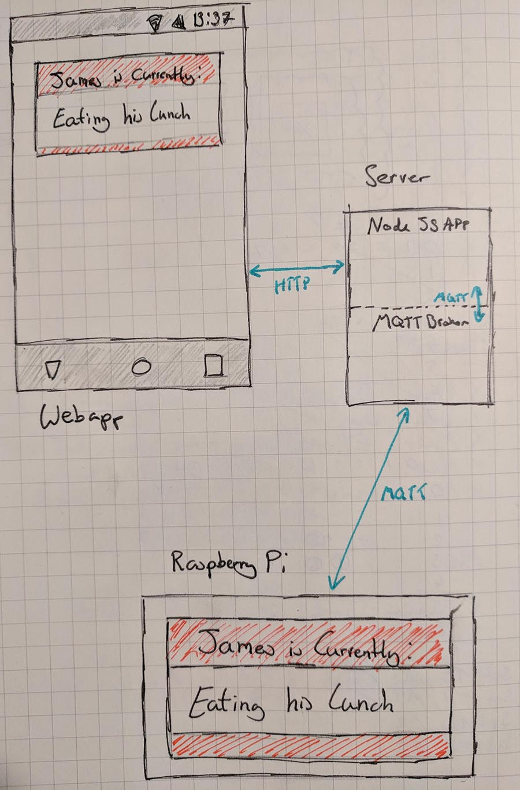
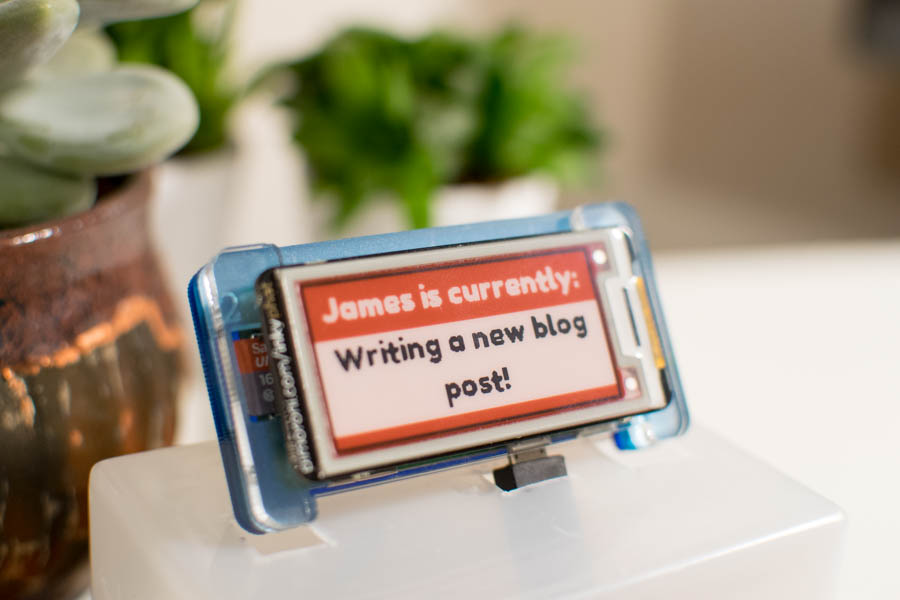

---
categories:
- mqtt
- pimoroni
- eink
- raspberry pi
date: "2018-01-08T18:54:02Z"
description: ""
draft: false
slug: eink-mqtt-status
summary: In this post, I built a physical status display using a Pimoroni Inky pHAT,
  MQTT, Python and Javascript
tags:
- mqtt
- pimoroni
- eink
- raspberry pi
title: E Ink Status Display
cover:
  image: cover.jpg
---


Having a lot of things on your plate is often overwhelming, I currently have three roles to juggle at work right now and sometimes find it hard to focus on the task at hand when there are distractions around me in the office, GitHub and of course Email! 

I came up with this project idea ironically whilst I was procrastinating and avoiding doing some tasks around the house that really needed doing, but hopefully it should help me: a) Focus on the task I've dedicated myself to at the time, and b) let anyone passing my desk know what 'hat' I'm wearing that day, or even if I'm at just lunch or working from home. I'd been eyeing up the [Pimoroni Inky pHAT](https://shop.pimoroni.com/products/inky-phat) as I wanted to have a play with an E Ink display for a while now, so once It arrived on my doormat, it didn't take long for project idea to come to me.

<iframe width="560" height="315" src="https://www.youtube.com/embed/rU995N-m13E?rel=0&amp;controls=0&amp;showinfo=0" frameborder="0" gesture="media" allow="encrypted-media" allowfullscreen></iframe>

## The Idea
This project is split into two halves, the first half: A client application running on a Raspberry Pi with the Pimoroni Inky pHAT attached, listening to a specific topic on an MQTT broker. The second half will be a React & Express web application that publishes status updates to the aformentioned MQTT topic.




## Server
The Server will host a single page webapp powered by React that will display a copy of the Inky pHAT display so that you can preview what the status update will look like. Once you click on the virtual display, a prompt will appear allowing you to set a new status, as soon as you submit, the Server will send that new status to a pre-defined topic on the MQTT broker.


One of the useful things that you might notice is that when starting the server or client, they will both pick up the last published status message (assuming the broker hasn't lost state). This is because the server publishes the status messages with the retain flag set to true. Every time that something subscribes to the status topic, it will automatically recieve the last message that was published with the retain flag set. It's a nice little feature that gives us somewhat an illusion of persistence, without having to set up a database or persistence file on the server somewhere. 

### Running the Server
1. Clone the repository: `git clone https://github.com/jpwsutton/status.git && cd status/server`
2. Install the server dependencies: `npm install`
3. Create a configuration file called .env containing the following (changing the settings to work with your MQTT broker):
    ```
    MQTT_HOST=hostname
    MQTT_PORT=8883
    MQTT_PROTOCOL=ssl
    MQTT_USER=username
    MQTT_PASS=password
    MQTT_ID=statusServer
    MQTT_TOPIC=statustopic
    HTTP_PORT=9000
    ```
4. Build the Static Content: `npm run build`
5. Run the Server: `node server`

The webapp will then be available on http://localhost:9000, When using it to update your status, you should see console output similar to this below:
```
Status Server is listening on port 9000!
Received new status: Building a Status display.
New Status: Writing a new blog post!
Received new status: Writing a new blog post!
```


## Client
For the client, you'll need a Raspberry Pi (Of the Modern 40-pin variety), in this example I'm using a Raspberry Pi Zero, but a Pi 3 or a Zero W would work just as well. Simply push the Inky pHAT on top and then install the library and dependencies required. Pimoroni have built this handy script that will do everything for you, just run:
`curl https://get.pimoroni.com/inkyphat  | bash`

Once the dependencies are installed, you might want to have a play with the examples to see just what this nifty display is capable of, Pimoroni have written up a great tutorial that you should read here: https://learn.pimoroni.com/tutorial/sandyj/getting-started-with-inky-phat 

### Running the Client
1. Clone the repository: `git clone https://github.com/jpwsutton/status.git && cd status/client`
2. Install the paho-mqtt library: `pip3 install paho-mqtt`
3. Create a configuration file called config.json containing the following (changing the settings to work with your MQTT broker):
    ```
    {
      "mqttConfig" : {
        "server" : "hostname",
        "port"   : 8883,
        "username" : "username",
        "password" : "password",
        "clientId" : "statusClient",
        "topic"    : "statustopic"
        }
      }
    ```
4. Run the script: `python3 status.py`, you should see console output similar to this, the client will print a new line for every status update it receives:
    ```
    pi@raspberrypi:~/status/client $ python3 status.py
    Connecting to Host iot.eclipse.org:1883
    Connected with result code 0
    Received: Writing a new blog post!
    ```
    
### Setting the client to run as a service
Unless you want to manually start the script every time you turn your Raspberry Pi on, you'll want it to start on boot and run in the background. I've put a systemd service file in the client directory that you can use to do this. Simply modify the file so that ExecStart line matches where you've put the script and then save it to `/lib/systemd/system/status.service`, you can then continue with the instructions here (https://www.raspberrypi-spy.co.uk/2015/10/how-to-autorun-a-python-script-on-boot-using-systemd/) to enable the service.

All the code is available on my GitHub here: https://github.com/jpwsutton/status, hopefully this post was a useful example of what you can do with the Pimoroni Inky pHAT, thanks for reading!



