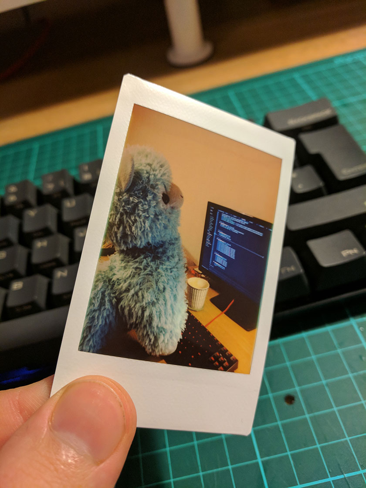

---
categories:
- instax
- python
- fujifilm
- sp-2
date: "2018-06-06T20:00:36Z"
description: ""
draft: false
slug: internet-connected-photo-printer-instaxapi
summary: A new Python API and Command line tool that lets you print photos from your
  computer, using the Fujifilm Instax SP-2
tags:
- instax
- python
- fujifilm
- sp-2
title: Internet Connected Photo Printer - InstaxAPI
cover:
  image: cover.jpg
---


Since I first started looking into this project, it's had to fall by the wayside a few times due to quite a lot of things going on in my life. However as of October 2017, I've now got a fairly solid Python API written that's available at [github.com/jpwsutton/instax_api](https://github.com/jpwsutton/instax_api) 🎉

It's pretty basic, but it has a CLI interface that lets you send a single image to your printer over WiFi and prints it out for you. It's a bit rough around the edges presently, but it does do what it says on the tin.

*The First print from my Instax SP-2, the model is my pair programming buddy.*

## How to use the tool

In order to use this library, you will need Python 3 installed on your computer, once that's done, run `pip3 install instax-api` to install this library.

You should then have the `instax-print` command available in your path.
If you call it without any arguments, you'll get the help information:
```
$ instax-print --help
usage: instax-print [-h] [-v] [-l LOG] [-o HOST] [-p PORT] [-i PIN]
                    [-t TIMEOUT]
                    image

positional arguments:
  image                 The location of the image to print.

optional arguments:
  -h, --help            show this help message and exit
  -v, --verbose         Print Verbose log messages to console.
  -l LOG, --log LOG     The location to store the JSON log,by default: ddmmyy-
                        hhmmss-log.json
  -o HOST, --host HOST  The Host IP to connect to the server on.
  -p PORT, --port PORT  The port to connect to the server on.
  -i PIN, --pin PIN     The pin code to use, default: 1111.
  -t TIMEOUT, --timeout TIMEOUT
                        The timeout to use when communicating.
```


In most scenarios, you wont' need to use any of the arguments listed above, the only one you might need is the `-i / --pin` argument if you have changed the pin on the printer from  it's default of 1111.

1. Turn on the printer.
2. On your computer, search for the correct wireless network and join it, the SSID should start 'INSTAX-'.
3. Run the following command: `instax-print myImage.jpg` replacing `myImage.jpg` with the name and location of the photo you want to print.
4. That should then print the photo, congratulations!

```
[20:01:52] jsutton@local:~/Desktop $ instax-print -o localhost holiday.jpg
--- Instax SP-2 Printer Python Client ---

Connecting to Printer.
Model: SP-2
Firmware: 01.13
Battery State: 3
Prints Remaining: 4
Total Lifetime Prints: 20

Printing Image: holiday.jpg
[============================================================] 100.0% ...Print is complete!
Thank you for using instax-print!

```

##Next Steps
I've got a bit more work to do around tidying up the printing script. Currently the photo is sent and the print command works, but I'd like to make it callable programatically with JSON output, as well as a basic query interface to get basic information back off the printer.

The Fujifilm Instax SP-3 has also been released which is a square format printer, I'm unlikely to get one for myself (However, Fujifim if you're reading this and would like me to support all of your printers, Tweet me! 😉), however I'm planning on updating the library to support the SP-1 and the SP-3 as well. This _should_ be fairly easy to do, as I can point the android app with the SP-3 set as the default printer at my test server to see if the same types of messages are sent. Right now, my best guess is that the protocol is virtually identical, with the exception that the resolution of the photo is different.

I'm also planning on integrating my printer into a larger project that was the inspiration for this in the first place, once I'm done, I should have an automated online printer that lets me send a photo to be printed over the internet using Node-Red and a Raspberry Pi. I'm hoping to have this one done before 2019 (If I have time!).

So if you've got an Instax SP-2 lying about and you'd like to print from your computer, please give this library a go! If you find any bugs, have suggestions for improvements or would like to contribute, please feel free to open an Issue / Raise a PR on my GitHub project here: [github.com/jpwsutton/instax_api](https://github.com/jpwsutton/instax_api)

