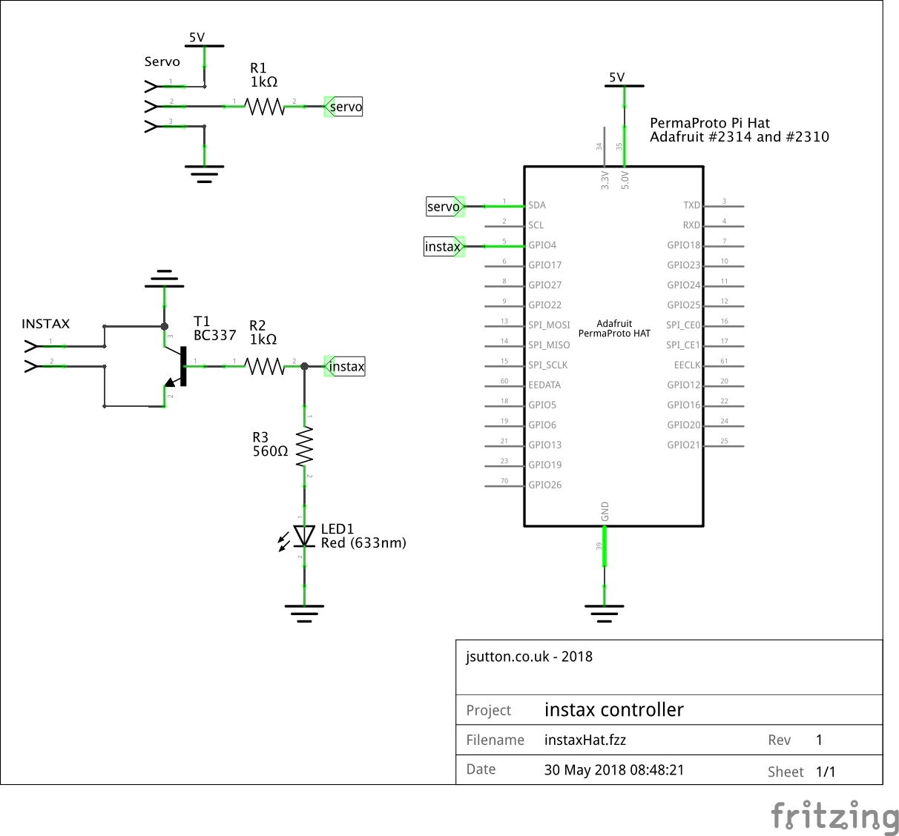
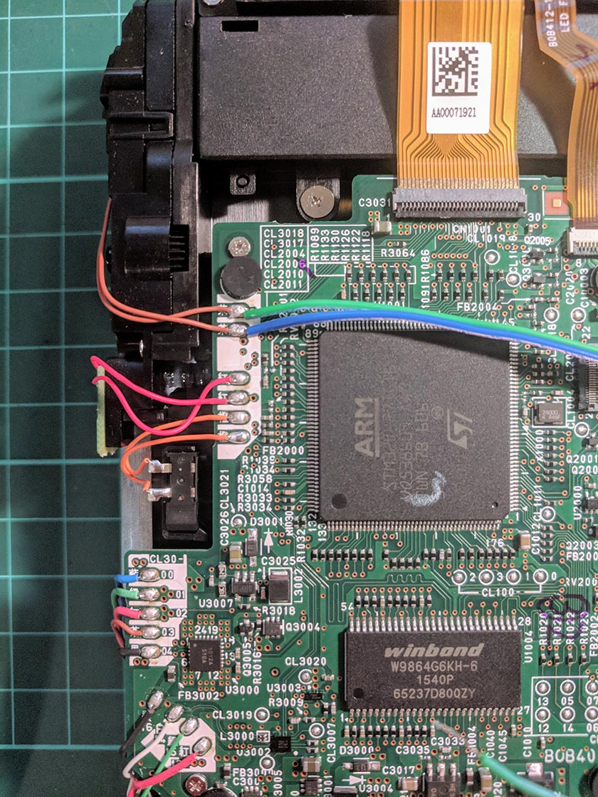
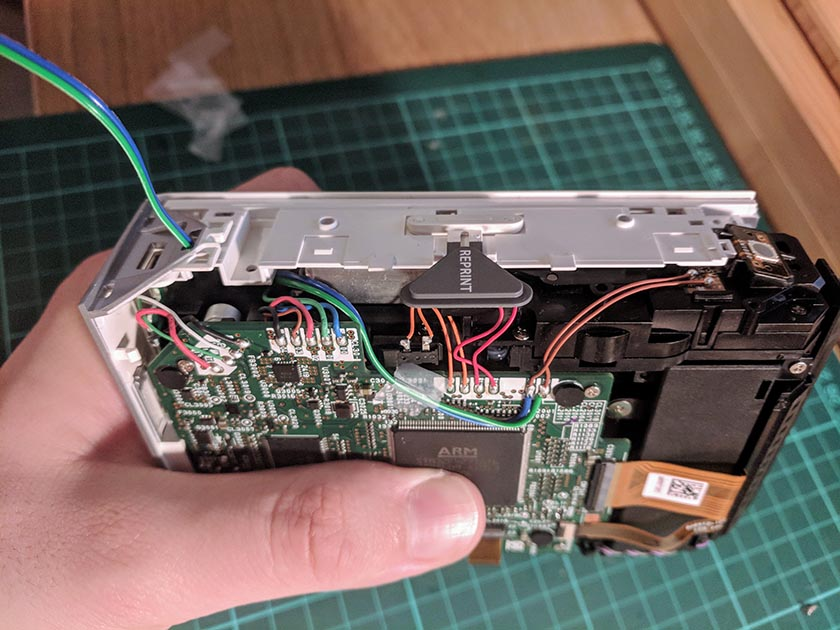
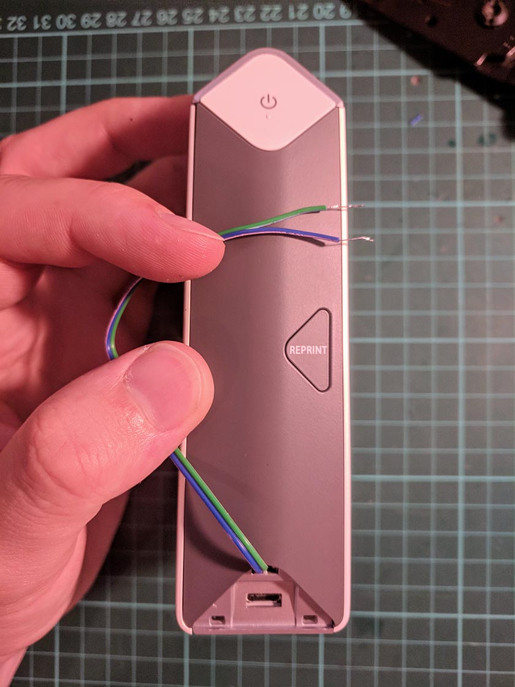
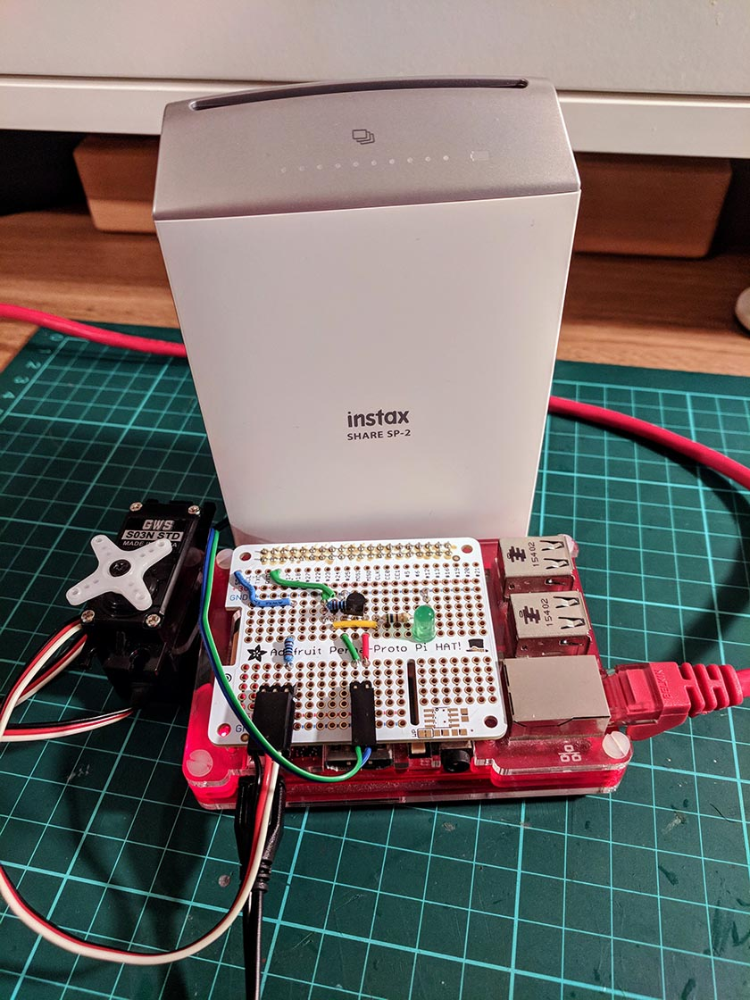
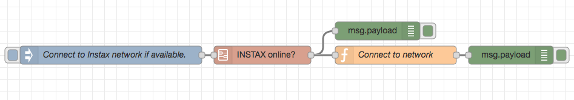

---
categories:
- fujifilm
- sp-2
- raspberry pi
- node-red
date: "2018-07-04T11:07:34Z"
description: ""
draft: false
slug: internet-connected-photo-printer-part-1
summary: Modifying a Fujifilm Instax SP-2 Printer so that it can be powered on and
  off by a Raspberry Pi.
tags:
- fujifilm
- sp-2
- raspberry pi
- node-red
title: 'Internet Connected Photo Printer - Part 1: Modding the SP-2'
cover:
  image: cover.jpg
---

For a while now, I've been slowly working on designing and building an Internet Connected Photo board that automatically prints photos for me ready to pin up. I chose the Fujifilm Instax SP-2 pretty quickly, and have so far spent most of my time writing a Python library to enable you to print to it using a normal PC or Raspberry Pi, rather than an Android or iOS device.

This first post describes the first stage of modifications that I needed to make to the SP-2 to make it possible to hide it away inside the Photo Board and to be able to turn it on and eject photos without any human intervention.

## Turning the SP-2 On and Off
The Instax SP-2 printer features a button on the side that if held for roughly a second, will turn the printer on and off. Once on, the printer will stay on for roughly 10 minutes of inactivity, after which it will turn itself off.
My goal was to be able to turn it on and off, simply by setting a pin high and low on a Raspberry Pi.

To accomplish this, I've built a simple circuit on an [Adafruit Perma-Proto HAT](https://www.adafruit.com/product/2310) that uses a BC337 NPN transistor and a 1K resistor to effectively act as a mini relay. I then soldered some hookup wire to the contact points for the switch inside the SP-2 and connected it to the transistor. Now when I drive the Pin connected to the transistor on the Pi high for a second, then the circuit will close and the SP-2 will power on, or off.

*Circuit Diagram for the Perma-Proto HAT.*

*Soldering the hookup wire to the conact points for the power switch.*

*Routing the power control wire out of the case.*

*All tidied away and with the case all back together.*

## Ejecting prints once the printer has done it's job.

As the printer exposes a print, it slowly ejects it out of the slot on the top of the printer. Once ejected, it still requires a small tug to pull the print out, this is great design for most use cases of the printer, but in this case, I'm going to be mounting the printer upside down and above a little tray for the prints to fall into, so I don't want the print to remain stuck in the printer. To resolve this, I've decided that a servo mounted below the printer slot with a rubber cam should do a good job of pulling the print the last few millimeters until it is free and can fall into the tray. Before I do this though, I need to connect the servo to the Raspberry Pi.

In scenarios where you are continuiously driving a servo, or if it is a high power servo, you will definitely need a secondary power supply, as a normal Raspberry Pi Power supply won't be able to drive both the Pi and Servo, resulting in potential brownouts, potentially damaging the Pi.

In this case though, after testing througoughly and using a good 2.5A power supply like the [Official Raspberry Pi Power supply](https://www.raspberrypi.org/products/raspberry-pi-universal-power-supply/), I found that there was plenty of power available to drive the servo for a short period. As I only needed it to move backwards and forwards once per print, I decided that the Pi's 5v line would be more than enough to power this servo.

*The fully assembled Perma-Proto HAT with the Power and Servo control components in place and working.*

## Test Node-Red flow

To test all of this functionality, I have built a simple Node-Red flow that tests the servo, power, and allows you to programatically search for the INSTAX-* WiFi network and connect to it using the piwifi npm module.
Feel free to give it a try by importing it from [here](https://gist.github.com/jpwsutton/7ff76acfd165059b3977d3ae3a00607c)

In my next post, I'll cover the design and build of the cradle that holds the SP-2 as well as the mechanism that the servo uses to eject the prints.

