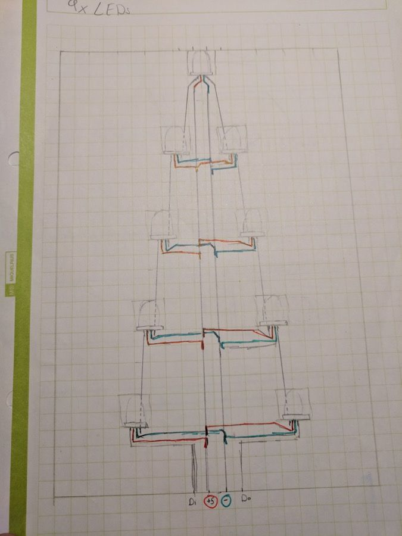
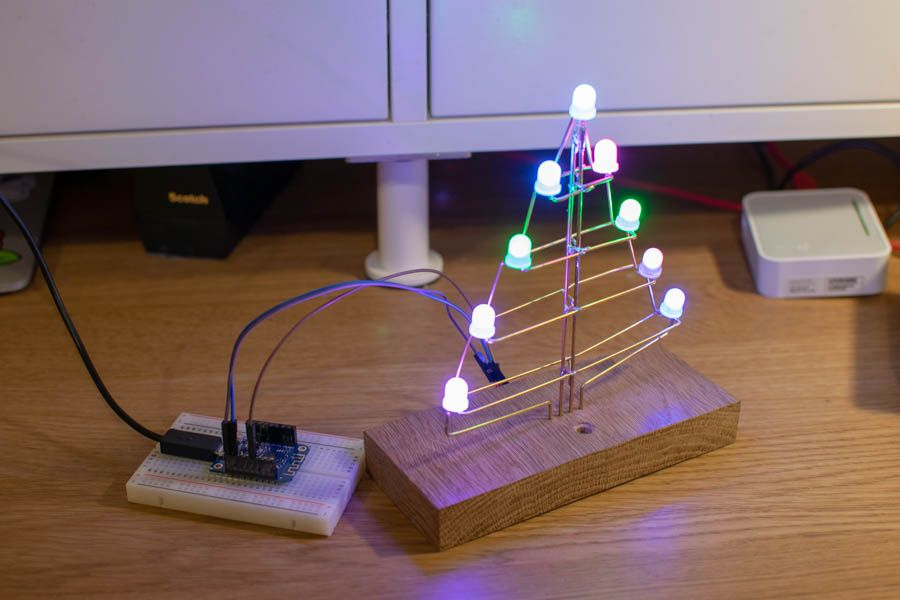
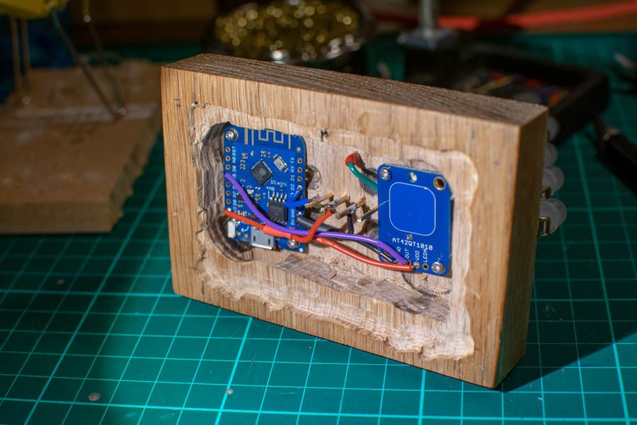

---
categories:
- iot
- mqtt
- node-red
- christmas
date: "2018-12-30T21:52:28Z"
description: ""
draft: false
cover:
  image: cover.jpg
slug: iotree
summary: This year, I wanted to build a connected Christmas Ornament for each of my
  family members. The aim was to build a light that looked nice, but also allowed
  us to feel connected even if we weren't together..
tags:
- iot
- mqtt
- node-red
- christmas
title: IoTrees
---

This year, I wanted to make something for my family for Christmas. The idea was to create an interactive festive ornament that would somehow allow us to stay connected, even though we all live apart. I was particularly inspired by projects like <a href="http://goodnightlamp.com/" target="_blank">Good Night Lamp</a>, <a href="https://www.youtube.com/watch?v=JeOPvjl9CH0" target="_blank">Ambient Kettle</a> and <a href="https://www.youtube.com/watch?v=PoPzBuoFOps" target="_blank">ESP8266 Christmas Ornaments</a>. By October, I'd whittled down my design. Each ornament would be a small LED Christmas Tree that would each be connected to a server. Each tree has a small button that when pressed, makes the tree flash in a 'festive' animation. At the same time, the other trees in the family will also flash with the same animation. The trees are configurable and can be any colour chosen when idle.

You can see the trees in action in the video below:

<iframe width="480" height="270" src="https://www.youtube.com/embed/2DRYdAPL3XY?feature=oembed" frameborder="0" allow="accelerometer; autoplay; encrypted-media; gyroscope; picture-in-picture" allowfullscreen></iframe>

## The Design

Around the same time that I had the idea for this project, I came across <a href="https://www.instagram.com/mohitbhoite/" target="_blank">@mohitbhoite</a> on instagram and immediately knew how I wanted to build the trees. I really love the simplistic, but stylish aesthetic of the free-form wiring that Mohit had used, and I thought that it could be used in a similar way to build a Tree shape.

<blockquote class="instagram-media" data-instgrm-captioned data-instgrm-permalink="https://www.instagram.com/p/BmmlnxfgFdr/?utm_source=ig_embed&amp;utm_medium=loading" data-instgrm-version="12" style=" background:#FFF; border:0; border-radius:3px; box-shadow:0 0 1px 0 rgba(0,0,0,0.5),0 1px 10px 0 rgba(0,0,0,0.15); margin: 1px; max-width:658px; min-width:326px; padding:0; width:99.375%; width:-webkit-calc(100% - 2px); width:calc(100% - 2px);">
 <a href="https://www.instagram.com/p/BmmlnxfgFdr/?utm_source=ig_embed&amp;utm_medium=loading" style=" background:#FFFFFF; line-height:0; padding:0 0; text-align:center; text-decoration:none; width:100%;" target="_blank"> 
 

 
 

 

<svg width="50px" height="50px" viewBox="0 0 60 60" version="1.1" xmlns="https://www.w3.org/2000/svg" xmlns:xlink="https://www.w3.org/1999/xlink"><g stroke="none" stroke-width="1" fill="none" fill-rule="evenodd"><g transform="translate(-511.000000, -20.000000)" fill="#000000"><g><path d="M556.869,30.41 C554.814,30.41 553.148,32.076 553.148,34.131 C553.148,36.186 554.814,37.852 556.869,37.852 C558.924,37.852 560.59,36.186 560.59,34.131 C560.59,32.076 558.924,30.41 556.869,30.41 M541,60.657 C535.114,60.657 530.342,55.887 530.342,50 C530.342,44.114 535.114,39.342 541,39.342 C546.887,39.342 551.658,44.114 551.658,50 C551.658,55.887 546.887,60.657 541,60.657 M541,33.886 C532.1,33.886 524.886,41.1 524.886,50 C524.886,58.899 532.1,66.113 541,66.113 C549.9,66.113 557.115,58.899 557.115,50 C557.115,41.1 549.9,33.886 541,33.886 M565.378,62.101 C565.244,65.022 564.756,66.606 564.346,67.663 C563.803,69.06 563.154,70.057 562.106,71.106 C561.058,72.155 560.06,72.803 558.662,73.347 C557.607,73.757 556.021,74.244 553.102,74.378 C549.944,74.521 548.997,74.552 541,74.552 C533.003,74.552 532.056,74.521 528.898,74.378 C525.979,74.244 524.393,73.757 523.338,73.347 C521.94,72.803 520.942,72.155 519.894,71.106 C518.846,70.057 518.197,69.06 517.654,67.663 C517.244,66.606 516.755,65.022 516.623,62.101 C516.479,58.943 516.448,57.996 516.448,50 C516.448,42.003 516.479,41.056 516.623,37.899 C516.755,34.978 517.244,33.391 517.654,32.338 C518.197,30.938 518.846,29.942 519.894,28.894 C520.942,27.846 521.94,27.196 523.338,26.654 C524.393,26.244 525.979,25.756 528.898,25.623 C532.057,25.479 533.004,25.448 541,25.448 C548.997,25.448 549.943,25.479 553.102,25.623 C556.021,25.756 557.607,26.244 558.662,26.654 C560.06,27.196 561.058,27.846 562.106,28.894 C563.154,29.942 563.803,30.938 564.346,32.338 C564.756,33.391 565.244,34.978 565.378,37.899 C565.522,41.056 565.552,42.003 565.552,50 C565.552,57.996 565.522,58.943 565.378,62.101 M570.82,37.631 C570.674,34.438 570.167,32.258 569.425,30.349 C568.659,28.377 567.633,26.702 565.965,25.035 C564.297,23.368 562.623,22.342 560.652,21.575 C558.743,20.834 556.562,20.326 553.369,20.18 C550.169,20.033 549.148,20 541,20 C532.853,20 531.831,20.033 528.631,20.18 C525.438,20.326 523.257,20.834 521.349,21.575 C519.376,22.342 517.703,23.368 516.035,25.035 C514.368,26.702 513.342,28.377 512.574,30.349 C511.834,32.258 511.326,34.438 511.181,37.631 C511.035,40.831 511,41.851 511,50 C511,58.147 511.035,59.17 511.181,62.369 C511.326,65.562 511.834,67.743 512.574,69.651 C513.342,71.625 514.368,73.296 516.035,74.965 C517.703,76.634 519.376,77.658 521.349,78.425 C523.257,79.167 525.438,79.673 528.631,79.82 C531.831,79.965 532.853,80.001 541,80.001 C549.148,80.001 550.169,79.965 553.369,79.82 C556.562,79.673 558.743,79.167 560.652,78.425 C562.623,77.658 564.297,76.634 565.965,74.965 C567.633,73.296 568.659,71.625 569.425,69.651 C570.167,67.743 570.674,65.562 570.82,62.369 C570.966,59.17 571,58.147 571,50 C571,41.851 570.966,40.831 570.82,37.631"></path></g></g></g></svg>

 
 View this post on Instagram

 

 

 

 

 

 

 

 

 

</a> 
 <a href="https://www.instagram.com/p/BmmlnxfgFdr/?utm_source=ig_embed&amp;utm_medium=loading" style=" color:#000; font-family:Arial,sans-serif; font-size:14px; font-style:normal; font-weight:normal; line-height:17px; text-decoration:none; word-wrap:break-word;" target="_blank">As much as I like 3D printing and designing PCBs, sometimes it’s very relaxing to just free form circuits and use them as structures. It was also fun learning to write a dot matrix driver from scratch. @particle</a>
 
A post shared by <a href="https://www.instagram.com/mohitbhoite/?utm_source=ig_embed&amp;utm_medium=loading" style=" color:#c9c8cd; font-family:Arial,sans-serif; font-size:14px; font-style:normal; font-weight:normal; line-height:17px;" target="_blank"> Mohit Bhoite | मोहित भोईटे</a> (@mohitbhoite) on <time style=" font-family:Arial,sans-serif; font-size:14px; line-height:17px;" datetime="2018-08-18T02:09:06+00:00">Aug 17, 2018 at 7:09pm PDT</time>

</blockquote>

A few sketches later, I realised that I really just needed to start playing with the materials to see what they could do, so I ordered a pack of <a href="https://hobby.uk.com/materials/metal/solid-brass-rod.html" target="_blank">brass rod</a>, some <a href="https://www.adafruit.com/product/1734" target="_blank">8mm NeoPixels</a> and got to work.

The design is quite simple, the tree has two central spines for both the + and - which then connect to the + and - of each NeoPixel via horizontal bars. The edge of the tree is then the data line that goes up the left and down on the right. The brass rods for Data, + and - (And a spare for symetry) are fixed to 4 holes in the middle of the wooden base. A final brass button is also inlaid into the wooden base to allow the tree to be triggered.

Inside the base is an <a href="https://wiki.wemos.cc/products:d1:d1_mini" target="_blank">Wemos D1 mini</a> (A fantastic little ESP8266 board) and an <a href="https://www.adafruit.com/product/1374" target="_blank">Adafruit Capacitive touch sensor breakout</a> which does all of the hard work for you.

After a lot of prototyping, re-building, tweaking of designs etc.. I was able to get this working:

## The Build

Once the prototype was complete, I started working on the final versions that I was going to give to my family, the build is separated into three parts; the Base, the Tree and the Controller.

### The Base

The Bases were cut out of small pieces of White Oak, approximately 20x100x60mm. The space for the controller was hollowed out using a pillar drill, though a CNC router would have been far more appropriate. I then tidied them up with a chisel before getting them cut to size (many thanks to my Dad and his workshop!). I also cut a small ledge into the opening and cut a 3mm acrylic sheet to fit it so that it would keep the electronics inside tidy.




### The Tree

As I was building 4 trees, I found a few ways to speed the build up, mainly through pre-bending as much of the brass rod as possible so that it was all ready to go when I got to soldering it. I also used graph paper (with 5mm spacing) and a fairly basic jig to help solder the brass and NeoPixels together consistently.

Once each horizontal beam was soldered, and the central columns had the 90 degree ledges attached, I then used two of the bases to maintain consistent spacing for the central columns whilst I soldered the horizontal pices on. Sadly I don't have any photos of this step as I was just a tad preoccupied!

Finally, the last and hardest step was to solder each of the 35mm diagnonal data lines to each of the NeoPixels Din and Dout pins. This really took a while as slight differences in each of the trees and hoizontal bars meant that each diagonal piece had to be a sligtly different leg/shape. Being careful to avoid any solder bridges at each NeoPixel was also a challenging task, but with a bit of patience and a good soldering iron, it only took about two hours to finish all of the trees.




### The Controller
Once the trees were complete, all that was left was to attach them to the base and connect the Wemos D1 Mini and Capacitive breakout. You can see the result below, it looks like (and is) a mess, but it's a mess that works which is all that matters! I took advantage of the extension pinout on the capacitive breakout to connect it to the drawing pin that I had glued into each tree base.

Once I was sure that everything was working correctly, I used some small self-tapping screws to attach the two boards to the base so that when the power cable was plugged in and removed, it wouldn't move them.

### Firmware and Cloud service

Once the trees were all built, I flashed them with the firmware, tested them, took some photos and then packed them up ready for Christmas.

I might post another entry about the code on a later date, but the principle is pretty simple.

Each tree is subscribed to a command topic on an MQTT server (In this case, I'm using the <a href="https://internetofthings.ibmcloud.com/" target="_blank">IBM Watson IoT Platform</a>). On that topic, it can recieve either configuration commands to change the idle colour and animation, or "cheer"commands that will trigger it to play the cheer animation for a few seconds (In this case a red and green chase).

When the capacitive button is pressed on top, the trees send a "cheer" event to the MQTT server which is then passed on to a <a href="https://www.nodered.org" target="_blank">Node-Red</a> server that then sends the relevant cheer commands to the other trees in the family. I'm also logging the event in a cloudant database and I plan to expose the list of "cheer" events on a web page at some point so that my family can look to see who sent cheer and when, in case they missed it when it was sent, or were wondering who sent the cheer.




