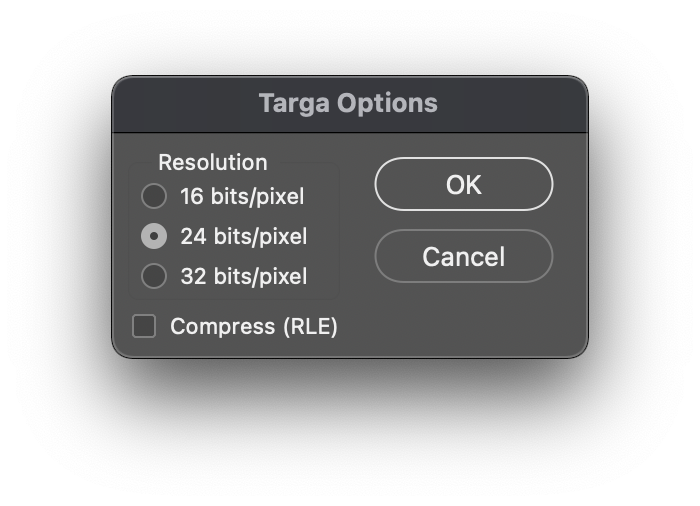

---
categories:
- pimoroni
- pico
date: "2021-02-21T19:10:53Z"
description: ""
draft: false
image: 
slug: rendering-images-on-the-pimoroni-pico-display
summary: How to render your own images on the Pimoroni Pico Display Pack and the Raspberry
  Pi Pico.
tags:
- pimoroni
- pico
title: Rendering Images on the Pimoroni Pico Display
cover:
  image: pico_discord_header_o.jpg
---


I'm currently working on a project that uses the [Pimoroni Pico Display Pack](https://shop.pimoroni.com/products/pico-display-pack) to display some images. It wasn't hugely obvious how best to go about this, but I was able to find a good example for the Pico Explorer that has a similar display ([https://github.com/pimoroni/pimoroni-pico/tree/main/examples/pico_explorer](https://github.com/pimoroni/pimoroni-pico/tree/main/examples/pico_explorer)). This post will explain the easy steps you need to follow in order to get an image of your choice onto the Pico Display.

---

## Step 1 - Preparing your image.
Your image will need to be in the [TGA](https://en.wikipedia.org/wiki/Truevision_TGA) format, both Photoshop and Gimp are able to save to this, and other image editing software should be able to as well. In Photoshop, you can export your image to `.tga` by using the "Save As" Menu, Select the "Targa" format in the list and then select the "24 Bits per Pixel".


---

## Step 2 - Setting up your CMakeLists.txt
You'll need to add some extra things to your CMakeLists.txt file so that we can bundle the tga image into the binary uf2 file that we deploy to the Pico.

This first section is a function that does the copying and bundling work for us.
```
function(add_resource target file)
  get_filename_component(NAME ${ARGV1} NAME_WE)
  set(FILENAME ${ARGV1})

  add_custom_command(
    OUTPUT ${NAME}.o

    COMMAND ${CMAKE_COMMAND} -E copy
            ${CMAKE_CURRENT_SOURCE_DIR}/${FILENAME}
            ${CMAKE_CURRENT_BINARY_DIR}

    COMMAND arm-none-eabi-ld -r -b binary -o ${NAME}.o ${FILENAME}
    DEPENDS ${FILENAME}
  )

  target_sources(${ARGV0} PRIVATE ${NAME}.o)
endfunction(add_resource)
```

Then, for every image that you want bundled:
```
add_resource(${NAME} your_image.tga)
```

---

## Step 3 - The Code
I'll assume that you're already pulling in the correct Pico Display libs, if you've not done that yet, you can check out the example here: https://github.com/pimoroni/pimoroni-pico/tree/main/examples/pico_display

#### Define the index for the image
This will be `_binary_` + the name of the file + `_tga_start`.
```
extern unsigned char _binary_your_image_tga_start[];
```

#### Add the function to render the image
```
void renderImage(unsigned char image[], int im_w, int im_h, int x_off, int y_off)
{
    //Colours are BGR, not RGB!
    
    //printf("Img ID Len: %d, CM: %d, Type: %d\n", image[0], image[1],image[2]);
    //int im_width = (image[13] << 8) | image[12];
    //int im_height = (image[15] << 8) | image[14];
    //printf("Image Width: %d, Height: %d\n", im_width, im_height);
    for (int y = 0; y < im_h; y++)
    {
        uint16_t *dest = pico_display.frame_buffer + (y * ((im_w - 1) * 3));

        uint8_t *src = image + 18 + (y * im_w * 3); 
        for (int x = 0; x < im_w; x++)
        {

            uint8_t b = *src++;
            uint8_t g = *src++;
            uint8_t r = *src++;

            pico_display.set_pen(r, g, b);
            pico_display.pixel(Point(x + x_off, im_h - y + y_off));
        }
    }
}
```

#### Call the render function with your image
When you want to render the image in your code, just call the following:
```
renderImage(_binary_your_image_tga_start, image_width, image_height, x_offset, y_offser);
```

Done! Your image should now be showing on your Pico Display, have fun!


