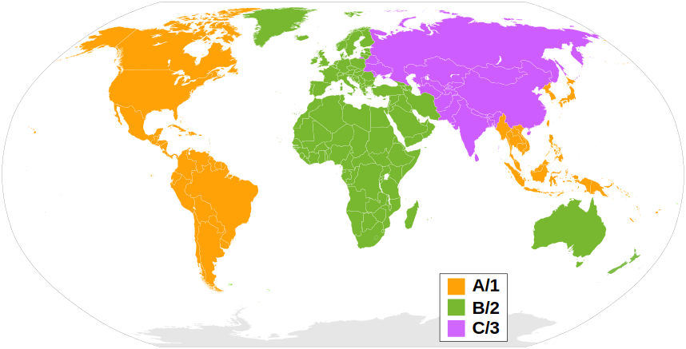

---
categories:
- python
date: "2021-02-06T22:49:34Z"
description: ""
draft: false
cover:
  image: PXL_20210130_192525870-1.jpg
slug: sync-dubs-with-python
tags:
- python
title: Reviving an old VCD dub with python
---

We have children in the family learning both English and Cantonese simultaneously, a great way to help support this will be to show them films that they will love in their mother tongue, and what better films to show children but films by Studio Ghibli?

But here's the problem:  Studio Ghibli films are in Japanese (naturally), but fortunately they've been translated into many languages and distributed world wide. Even better, they're now even available on Netflix. However, for simplicities sake, you tend to only be able to get the translated version for the country or region that you're living in, so for the UK... English.



You can, if you're lucky, find copies of the Cantonese Blu Ray available to import, but then you usually face two problems:
1. High Price. The English copy of the Spirited Away Blu Ray is about £12 on Amazon UK, but the cantonese import is over £45!
2. Region Locking. Thankfully Blu Ray only has 3 regions compared to DVD's 6! But it's still a problem if you can afford to import a  blu ray from another contintent. You could then import the relevant player, but that's a lot of wasted cash.



"Ok", I hear you say, "... but you can just stream these films online now, surely the cantonese dub must be available?". Sadly not, as of 2021, the only way to watch Ghibli films online is on Netflix, and you do have some extra dubs available, but only a tiny fraction of the ones in existence.



## As luck would have it...

.. a family member had been in Hong Kong back in the mid 2000's and brought back a box set of Studio Ghibli Cantonese dubbed VCDs. Not DVDs, **VCDs**. These seemed to come and go pretty quickly in the west, being replaced by DVDs. In Asia however, VCDs were popular for far longer ([https://en.wikipedia.org/wiki/Video_CD#In_Asia](https://en.wikipedia.org/wiki/Video_CD#In_Asia)). VCDs have two main problems when using them in 2021: Firstly, the quality can only be accurately summarised as "[Potato](https://knowyourmeme.com/memes/recorded-with-a-potato)". Secondly, because a CD is limited to 700MB, the film has to be split in half across two disks. A bit pants in this modern day and age really!

But let's not look a gift horse in the mouth, there is definitely something we can do with these!

I already own almost all of the UK releases of the Ghibli films, so now I had the perfect source material; High Quality video from the Blu Ray versions of the films, along with relatively decent Cantonese dubbing of the same film on VCD. All we need to do is find a way to copy the Cantonese Dub onto the High Quality video...



## So how do we do this?

My original plan had four simple steps:
1. Rip the Blu Ray and VCD versions to my computer.
2. Extract the Cantonese Dub from the VCD version.
3. Add it as a new language track on the extracted mp4.
4. Enjoy a classic film in a new language on my HD TV.

Alas, the best made plans, often go awry..
* The VCD films are split int two, meaning they need to be re-joined (Nothing a little ffmpeg magic can't do!).
* The Join in the middle is sometimes, but not always exact, meaning that there may be milliseconds missing in the middle when compared to the full length film.
* The VCD film and Blu Ray films are not entirely identical, the VCDs have a black screen with the name of the local distributor at the start for a few seconds (of varying length).

## New Plan - Choirless to the Rescue!

Re-winding back to 2020, some colleagues of mine in IBM had a fantastic idea for our Internal Call for Code competition. [Choirless](https://www.choirless.com/) is an online web service that allows distanced choir and band members to record their performances separately and to have them automatically synchronised and merged into a fantastic performance video. The summary of Choirless is well worth a watch:

<iframe width="640" height="360" src="https://cinnamon.video/embed?v=354021312575833651" frameborder="0" allow="monetization; accelerometer; autoplay; encrypted-media; gyroscope; picture-in-picture" allowfullscreen></iframe>

It struck me that the work Choirless does to synchronise all of the performers could potentially be the magic bullet for solving this, [@HammerToe](https://twitter.com/HammerToe) had written some clever python that could take two audio streams and synchronise them and even had streamed a walkthrough of his code that I had managed to catch months ago by chance:

<iframe width="640" height="360" src="https://cinnamon.video/embed?v=318119613646767615" frameborder="0" allow="monetization; accelerometer; autoplay; encrypted-media; gyroscope; picture-in-picture" allowfullscreen></iframe>

Anything that I could explain here about my process would just be a re-hashing of the above video, so I highly recommend that you check it out. But the key point is this: Whilst both the Japanese and Cantonese audio tracks will be different because of the language differences, there is still plenty of audio that should be (almost) _**identical.**_ All of the music and sound effects should be the same across both versions, so that will give us exactly what we need to identify the correct starting points for the Cantonese dub.

## How it works



The process starts off with extracting the video & audio from the Blu Ray and VCDs onto your computer, I used [handbrake](https://handbrake.fr/) for this.

Then you process the HQ Video (Primary) and the first VCD Video (Secondary). The python script will use the onset strength to look for peaks in both audio streams, it will then do forward and back passes with different offsets to find the best match for where the onset strength matches up.



Now because the VCD was split in two, we need to work out at which point the audio "should" start, so that we can skip forward on the primary track to the right place to give us our best chance of finding the offset. This is basically the following formula:

`hq_offset = part_1_duration - part_1_offset`

Once we've got that, we repeat the synchronisation process for the second half of the audio! Sometimes the difference is positive rather than negative, this means that there is sadly a gap in the middle, so we need to add a slight delay in the middle before carrying on, so keep that in mind when you're doing this yourself.

At this point, we should have the following:
- HQ rip of the Blu Ray
- LQ Rip Parts 1 and 2 of the VCD
- The offset in milliseconds for both parts of the VCD audio.

Now for the fun part, use [sox](http://sox.sourceforge.net/#:~:text=SoX%20is%20a%20cross%2Dplatform,audio%20files%20on%20most%20platforms.) to join the audio streams together, if you need to add some "dead air" in the middle, then use you can also generate some empty audio with sox:

Generate 510ms of blank audio:
`sox -n -r 44100 -c 1 silence510ms.wav trim 0.0 0.510`

Merge Audio Streams:
`sox file1.wav file2.wav merged.wav`

Add your merged audio into your existing HQ film:
`ffmpeg -i high_quality_film.mp4 -i cantonese_merged.aac -map 0 -map 1:a -c copy high_quality_film_Cantonese.mp4`

Tada! You should now see a new audio track on your film in the language of your choice for you to personally enjoy. Remember to only use this process on your own personal copies of the media and don't distribute them to anyone else as that could land you in hot water!

## The Code.

The code I've thrown together definitely isn't anything near production as I've just had to use it for the handful of disks I own, but you're more than welcome to use it for your own purposes. I've thrown it up on GitHub for you use here:



