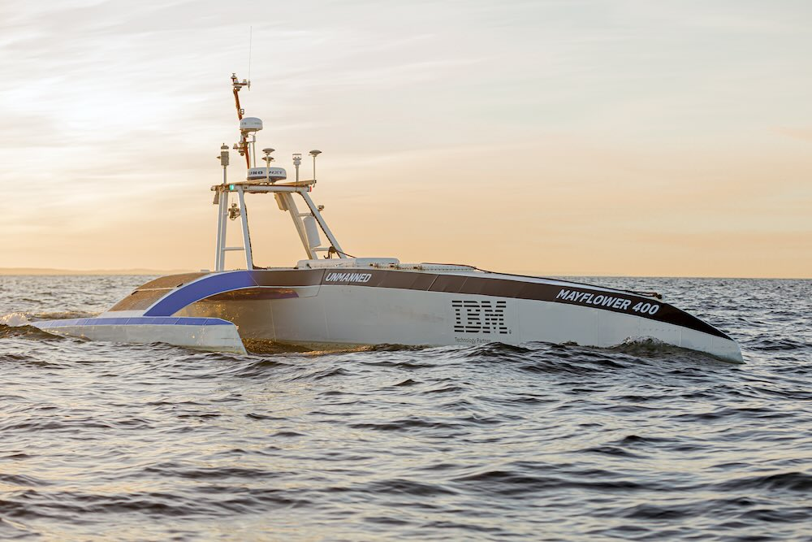

## Mayflower Autonomous Ship

The Mayflower Autonomous Ship is a first of its kind Autonomous Trimaran that demonstrated the advanced AI captain jointly developed by Marine AI and IBM. The MAS successfully completed its crossing of the Atlantic in 2022 and carried a Science payload that was contributed to by researchers within IBM and from a number of partner universities around the UK. I worked to bring all of those experiments together in both software and hardware, integrate them into the MAS and build the orchestration flows that would allow them to collect data autonomously at sea over long periods with little to no comms.

 - [Science Data Feed Documentation](https://jpwsutton.github.io/mayflower_autonomous_ship_data/)

---